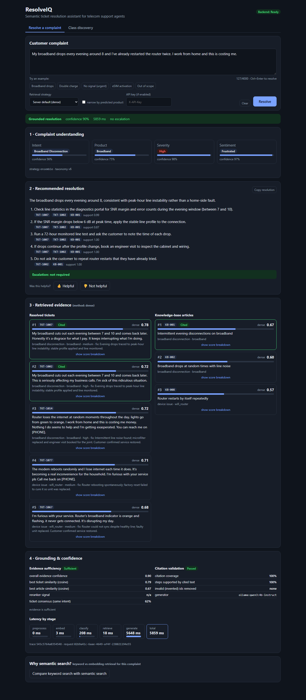
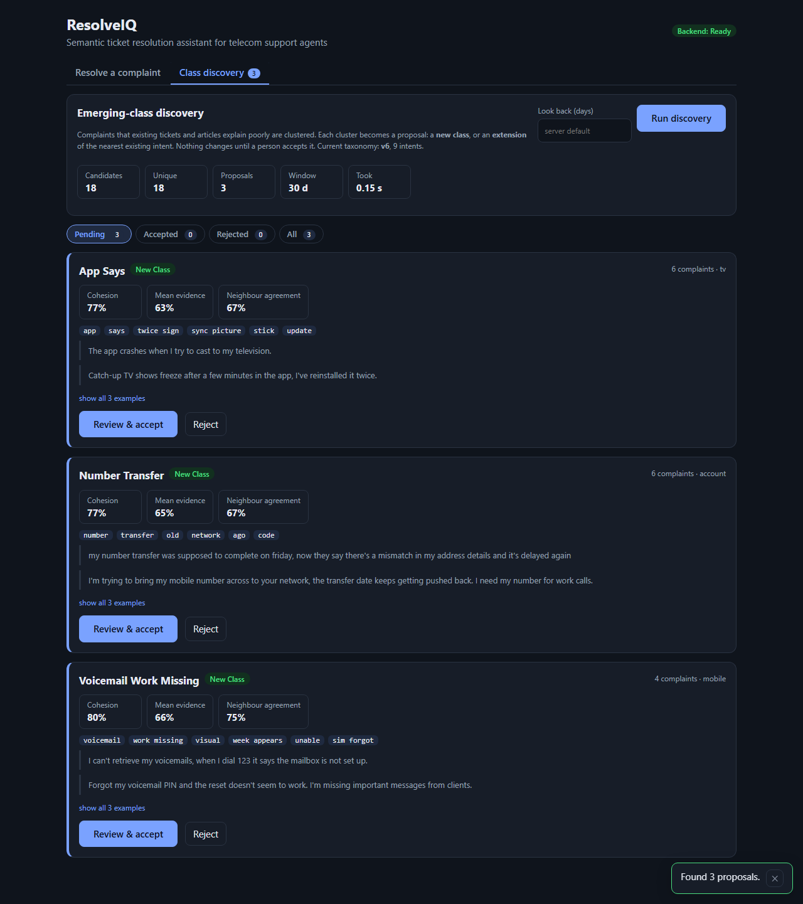
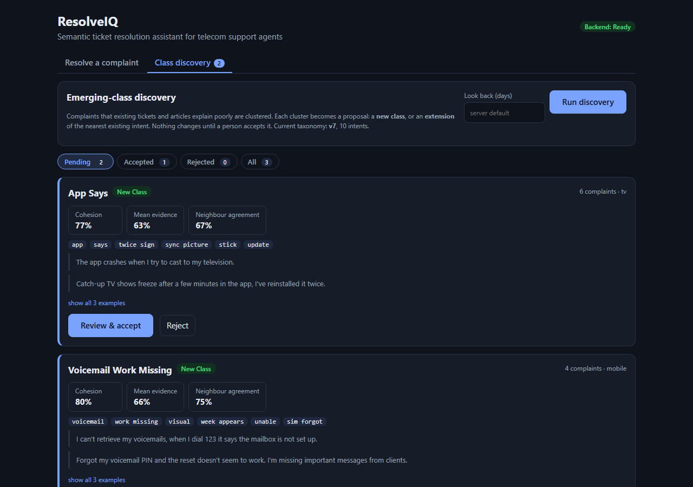
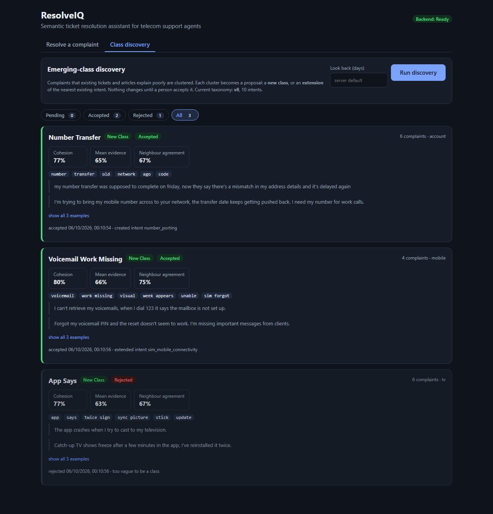
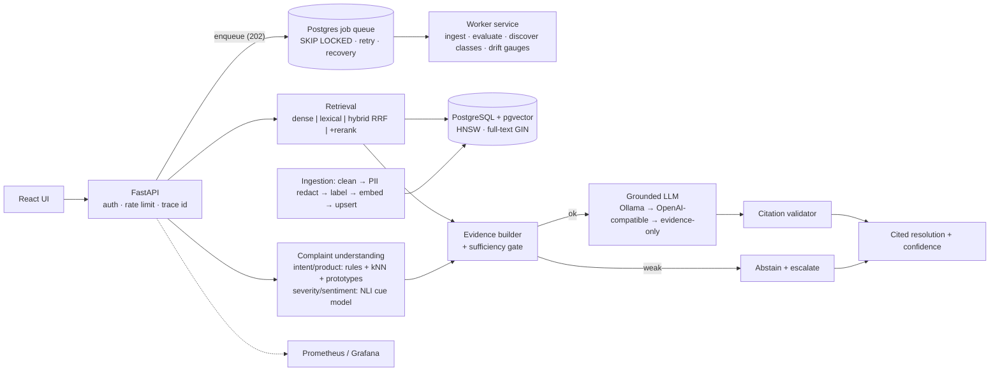

# ResolveIQ - Intelligent Support Ticket Resolution Assistant (telecom)

A production-oriented prototype that turns a raw telecom complaint into a **cited, step-by-step resolution** grounded in
previously resolved tickets and knowledge-base (KB) articles - and **abstains and escalates** when the evidence is weak.


## Screenshots
The React UI has two sections: resolving a complaint, and reviewing the classes that emerging-class discovery proposes.



| Discovery proposals | Reviewing one (extend an existing intent) | After review (audit trail) |
|---|---|---|
|  |  |  |

## 1. Problem statement
Support agents search past tickets and KB articles by keyword (`router`, `billing`, `speed`). That fails when the same problem is
worded differently: *"Internet connection disconnects every night"* vs *"My broadband keeps dropping around 8 PM each day"*.
For each complaint the system must parse it (intent, product, severity, sentiment), retrieve semantically similar resolved tickets
and KB articles, generate a grounded resolution with exact citations, avoid hallucinating when evidence is weak, and keep working
as data and ticket classes evolve.

## 2. Business motivation
Faster first-contact resolution and shorter handle time (agents see the proven fix, with its source), consistent answers across
agents, safer automation (abstention + validation instead of confident guesses), and a corpus that improves every time a resolved
ticket is ingested.

## 3. Architecture
Full diagrams (request path, ingestion path, data model) and module map: [`docs/architecture.md`](docs/architecture.md).

Two services share PostgreSQL (data, vectors, taxonomy, audit trail **and the job queue**) and Redis: an interactive **API** and a
**worker** (batch ingestion, evaluation, emerging-class discovery, re-index). The API never runs heavy jobs; it enqueues them.



## 4. Technology choices
Python 3.11 · FastAPI/Pydantic/Uvicorn · PostgreSQL 17 + pgvector (HNSW) + built-in full-text search · sentence-transformers
`all-MiniLM-L6-v2` (384-d) and cross-encoder `ms-marco-MiniLM-L-6-v2` · NLI model `deberta-v3-large-zeroshot-v2.0` for severity /
sentiment cues · scikit-learn (class discovery clustering) · Ollama with `qwen3:4b-instruct` (default) behind an OpenAI-compatible
fallback provider · Redis (cache, shared rate limit) · React + Vite · Prometheus (+ alert rules) + Grafana · OpenTelemetry tracing (OTLP, optional Jaeger) · Docker Compose · Kubernetes manifests · pytest.
One database for vectors, text, taxonomy, jobs and audit keeps the system simple to run and consistent; no paid API is required.

## 5. Data pipeline
Synthetic, seeded, scenario-driven telecom corpus (27 root-cause scenarios: 250 tickets, 26 KB articles, 150 held-out paraphrase
queries, 26 hand-written gold queries, 12 out-of-domain queries, 2 classes held back for the evolving-data demo).
`generate_dataset.py` → `data/raw` (messy export with fake PII) → `prepare_data.py` → `data/processed` (schema-mapped, normalised,
redacted) → `seed.py` → the same ingestion service the API uses. Source, mapping, leakage control and limitations:
[`docs/dataset.md`](docs/dataset.md). **No public dataset was used.**

## 6-8. Retrieval, hybrid search, reranking
`dense` (pgvector cosine), `lexical` (Postgres FTS, OR query pruned to rare terms), `hybrid` (weighted Reciprocal Rank Fusion of both),
`hybrid_reranked` (cross-encoder over the fused top-20, blended back with the fused score), plus an eval-only in-memory `bm25`
baseline. All return the same auditable shape (`source_type, source_id, score, rank, retrieval_method, metadata`, per-stage scores).
**On this corpus dense retrieval won**, so it is the default; hybrid and reranking stay selectable per request and are benchmarked
in [`docs/evaluation.md`](docs/evaluation.md) (including why they did not help here).

## 9-10. RAG approach and citation strategy
Top 3 tickets + 2 articles become labelled evidence blocks (`[TKT-1007]`, `[KB-001]`). The prompt forbids outside knowledge and
invented steps, requires JSON with per-step citations, and treats the complaint as untrusted data. After generation a validator
(a) removes and reports any cited id that was not retrieved, (b) flags steps with no citation, (c) flags steps not supported by the
cited text, and (d) marks the response `unreliable` and forces escalation when checks fail. If evidence sufficiency
(similarity · rerank · intent consensus) is below the threshold the LLM is **not called**: the answer is `abstained` with the
responsible team. If the LLM is down, the answer is `degraded`: steps copied from the cited past resolutions.

## 11. Evolving data and classes
* New resolved ticket / article: `POST /api/v1/ingest/ticket|article` - searchable immediately, response cache invalidated.
* New class: `POST /api/v1/taxonomy/labels` (data only; versioned; zero-shot via description/example prototypes, improves as
  tickets arrive). Stale KB: `POST /api/v1/articles/{id}/deprecate`. Embedding model change: per-model embedding rows + `reindex()`.
* **Classes nobody has named yet** - `POST /api/v1/taxonomy/discover` (also scheduled daily by the worker) clusters recent requests
  the corpus explains poorly and produces reviewable *proposals* (keywords, exemplars, suggested product/team, `new_class` vs
  `extend_existing`); `.../proposals/{id}/accept|reject` closes the loop, and the **Class discovery** tab of the UI does the same for a human reviewer
  (run discovery, inspect cohesion / evidence / examples, create a new intent or extend an existing one, reject with a reason). Needed because the abstention gate catches only a minority
  of complaints from genuinely new classes - the rest get a confident answer from the nearest existing class.
* **Label-free drift monitoring** - `GET /api/v1/monitoring/drift` + Prometheus gauges/alerts (abstention rate, evidence confidence,
  intent/severity/sentiment mix shift, negative feedback).
* Demonstrated by `tests/test_ingestion_and_evolution.py` and the `evolving` suite (2 new intents, 12 tickets, 2 articles ingested
  in 0.6 s, Hit@5 0.00 → 0.92). Strategy details: [`docs/production.md`](docs/production.md) §3.

## 12. API
Interactive docs at `/docs`. Auth: `X-API-Key` when `API_KEYS` is set.

| Endpoint | Purpose |
|---|---|
| `POST /api/v1/resolve` | complaint → classification, tickets, articles, cited steps, confidence, escalation, latencies |
| `GET /api/v1/search?q=&strategy=&source=&limit=&offset=&intent=&product=` | inspect retrieval with any strategy |
| `POST /api/v1/ingest/ticket` · `/ingest/article` · `/ingest/tickets/batch` (202 + job) · `GET /api/v1/jobs/{id}` | ingestion |
| `GET/POST /api/v1/taxonomy`, `/taxonomy/labels` | versioned label taxonomy |
| `POST /api/v1/taxonomy/discover` (202 + job) · `GET /taxonomy/proposals` · `POST /taxonomy/proposals/{id}/accept\|reject` | emerging-class discovery and review |
| `GET /api/v1/monitoring/drift` | label-free production drift report |
| `POST /api/v1/articles/{id}/deprecate` | retire stale KB |
| `POST /api/v1/evaluate` · `GET /api/v1/evaluate/{job}` | run evaluation suites as a background job |
| `POST /api/v1/feedback` · `GET /api/v1/tickets` · `/articles` · `/stats` | feedback, paginated browsing, overview |
| `GET /health` · `/health/ready` · `/metrics` | liveness, readiness, Prometheus |

### Example
```bash
curl -s localhost:8100/api/v1/resolve -H 'Content-Type: application/json' -d '{"complaint":
"My broadband drops every evening around 8 and I have already restarted the router twice. I work from home and this is costing me."}'
```
Abridged response (real output):
```json
{ "status": "resolved", "generator": "ollama:qwen3:4b-instruct", "confidence": 0.905,
  "classification": {"intent": "broadband_disconnection", "product": "broadband", "severity": "high", "sentiment": "frustrated",
                     "confidence": {"intent": 0.56, "product": 0.75, "severity": 0.5, "sentiment": 0.8}},
  "tickets": [{"source_type": "ticket", "source_id": "TKT-1007", "score": 0.78, "rank": 1, "retrieval_method": "dense", "...": "..."}],
  "resolution": {"steps": [
     {"text": "Check line statistics in the diagnostics portal for SNR margin and error counts during the evening window.",
      "citations": ["TKT-1007", "TKT-1002", "KB-001"], "grounded": true},
     {"text": "If the SNR margin drops below 6 dB at peak time, apply the stable line profile.", "citations": ["TKT-1007", "KB-001"]}],
     "escalate": false},
  "validation": {"valid": true, "invalid_citations": [], "citation_coverage": 1.0, "grounded_ratio": 1.0},
  "latency_ms": {"embed": 2, "classify": 16, "retrieve": 2, "generate": 6674, "total": 6693} }
```
An out-of-domain complaint returns `"status": "abstained"`, no steps, and `"escalation_reason": "Evidence is insufficient ... escalate to a ..."`.

## 13. Local setup (backend on the host, DB/Redis in Docker)
Requirements: Python 3.11, Node 20+, Docker, optionally Ollama with `ollama pull qwen3:4b-instruct` (without it the system runs in
evidence-only `degraded` mode).
```bash
cp .env.example .env                       # passwords here must match DATABASE_URL / DATABASE_ADMIN_URL
docker compose up -d db redis
cd backend && pip install -r requirements-dev.txt
python -m app.db.migrate                    # schema + least-privilege grants
python scripts/seed.py                      # taxonomy + 250 tickets + 26 articles through the ingestion pipeline
python scripts/train_affect.py              # (only if you change the NLI model / cues) retrain data/models/affect_v1.json
JOB_EXECUTION=queue python -m app.worker &  # worker service (omit and leave JOB_EXECUTION=inline to run jobs inside the API)
JOB_EXECUTION=queue python scripts/dev_server.py   # API on http://127.0.0.1:8100  (Windows-safe event loop)
cd ../frontend && npm install && npm run dev  # UI on http://127.0.0.1:5174 (proxies /api)
python scripts/generate_dataset.py && python scripts/prepare_data.py   # optional: regenerate data (deterministic)
```
Use `127.0.0.1` (not `localhost`) for Postgres on Windows; `localhost` can resolve to IPv6 and hang.

## 14. Production deployment (TLS, auth, HA-ready)
```bash
python deploy/gen_secrets.py --domain support.example.com --email ops@example.com   # random secrets + API keys -> .env.prod
docker compose --env-file .env.prod -f docker-compose.prod.yml up -d --build        # TLS proxy, 2 API replicas, Postgres, Redis, UI
python deploy/smoke_test.py https://support.example.com --api-key <agents key>      # must print SMOKE TEST PASSED
```
Only the TLS proxy (Caddy, automatic HTTPS) is public; the API refuses to start in production without strong API keys, explicit
CORS and non-placeholder DB passwords; `/metrics` is not public; backup/restore scripts, Prometheus + Grafana profile,
Kubernetes manifests (`k8s/base/`), and CI are included. Full runbook: [`docs/DEPLOYMENT.md`](docs/DEPLOYMENT.md).

## 14a. Kubernetes (tested on a local kind cluster)
```bash
bash k8s/local/deploy.sh --ingress       # kind cluster, images, Postgres+pgvector, Redis, migrate/seed Job, API x2, worker, frontend x2, Jaeger, Ingress
python k8s/local/e2e_test.py --ingress   # 22 checks: probes, auth, metrics, real resolve through the Ingress, worker ingestion, traces
```
The manifests were applied to a real (single-node) cluster and a complaint was resolved end to end through Ingress → nginx → API → Ollama; with the
LLM unreachable the API kept answering from evidence only. The run found and fixed seven real defects (missing seed data, Hugging Face calls hanging
under default-deny egress, an OOM-killed migrate Job, FastAPI's built-in OpenTelemetry duplicating spans, **taxonomy changes not reaching other API
replicas**, slow failures against a packet-dropping LLM, 502s during rolling restarts). It is **not** a production-grade Kubernetes claim: one node,
no managed database, no real TLS certificate, kind's network-policy agent. What was and was not tested, the commands, scaling, persistence, secrets,
ingress/TLS, autoscaling and observability considerations, and what changes in the cloud: [`docs/kubernetes.md`](docs/kubernetes.md).

## 14b. Development Docker setup
```bash
cp .env.example .env
docker compose up -d --build                         # db, redis, migrate+seed (one-shot), backend :8100, worker, frontend :5174
docker compose --profile monitoring up -d            # + Prometheus :9091, Grafana :3001 (admin/admin, dashboard provisioned)
docker compose --profile ollama up -d                # optional bundled Ollama (then set OLLAMA_BASE_URL_DOCKER=http://ollama:11434 and pull the model)
```
By default the backend container calls an Ollama on the host (`host.docker.internal:11434`). Host ports are offset
(5433/6380/8100/5174/9091/3001) so they do not clash with other local stacks. This is the **dev** topology (no TLS, auth off); use section 14 for deployment.

## 15. Running tests and evaluations
```bash
cd backend
python -m pytest tests -q                    # 100 tests; DB tests use a throw-away `resolveiq_test` database (need `docker compose up -d db redis`)
python -m app.evaluation.tuning              # hyper-parameter selection on the validation split
python -m app.evaluation.run --suites classification retrieval robustness evolving discovery   # ~4 min on a GPU, no LLM needed
python -m app.evaluation.run --suites rag e2e --judge 20 --alt-openai-model qwen3:4b-instruct  # needs Ollama; ~10 min
python -m app.evaluation.gate                # CI quality gate: exit 1 if any metric fell below data/eval/thresholds.json
# load test (Locust; throw-away database; see loadtest/README.md and docs/production.md):
python loadtest/run_loadtest.py --suite mytest --scenarios no_llm llm --levels 1 5 10 25 --duration 60 && python loadtest/summarize.py mytest
python scripts/embedding_experiment.py       # embedding-model comparison (no DB)
```
Writes `data/eval/results/latest.json` and `docs/evaluation_results.md`. `data/eval/results/baseline_v1.json` is the run recorded
before the affect model, robustness, discovery and worker work (kept for before/after comparison).

## 16. Observability and tracing
Logs (JSON with `trace_id`) and Prometheus metrics are always on. **OpenTelemetry tracing is opt-in** and shows where the time goes in one
request: HTTP > `resolve` > preprocess, cache, embedding, classification (incl. the affect model), retrieval, reranking, evidence gate,
LLM generation, citation validation and the audit write, with Postgres, Redis and LLM-HTTP spans underneath; ingestion and worker jobs are
traced too (a job links back to the request that queued it).
```bash
docker compose --profile tracing up -d jaeger                       # optional viewer, UI on http://127.0.0.1:16686
export OTEL_TRACES_EXPORTER=otlp OTEL_EXPORTER_OTLP_ENDPOINT=http://127.0.0.1:4318    # none (default) | otlp | console
cd backend && python scripts/dev_server.py                          # then search the tag resolveiq.trace_id=<X-Trace-Id>
```
`X-Request-Id` / `X-Trace-Id` / `trace_id` behave exactly as before and are stored on the HTTP span, so a log line, a support ticket or a
`resolution_requests` row finds its trace; log lines also gain `otel_trace_id` while tracing is on. Spans never contain complaint text, prompts or
model output (asserted by a test). Details, span reference and configuration: [`docs/observability.md`](docs/observability.md).

## 17. Evaluation results (recorded run; details in [`docs/evaluation.md`](docs/evaluation.md))
Held-out paraphrase queries, tickets, n=100:

| Retrieval | Hit@1 | Hit@5 | MRR | nDCG@10 | p50 ms |
|---|---|---|---|---|---|
| lexical (Postgres FTS) | 0.15 | 0.45 | 0.28 | 0.13 | 4.9 |
| BM25 | 0.28 | 0.54 | 0.40 | 0.20 | 1.5 |
| **dense (default)** | **0.66** | **0.93** | **0.77** | **0.49** | 1.6 |
| hybrid (RRF) | 0.58 | 0.91 | 0.72 | 0.42 | 7.2 |
| hybrid + rerank | 0.57 | 0.90 | 0.72 | 0.42 | 22.7 |

* **Classification** (accuracy; `gold` = 101 hand-written, `blind` = 50 hand-written after the model was frozen):

  | | intent | product | severity | sentiment |
  |---|---|---|---|---|
  | rules + kNN only (before) - gold | 0.95 | 0.98 | 0.48 | 0.39 |
  | rules + kNN only (before) - blind | 0.96 | 0.92 | 0.48 | 0.48 |
  | **shipped (NLI affect model) - gold** | 0.95 | 0.98 | **0.65** | **0.66** |
  | **shipped - blind** | 0.96 | 0.92 | **0.64** | **0.78** |

  Severity/sentiment come from a pretrained NLI model scoring 14 semantic cues plus a tiny combiner trained on synthetic tickets
  only. On the templated `test` set the old keyword rules score 1.00 / 0.98 because they share vocabulary with the generator
  (circular); the honest numbers are the hand-written ones. Severity is within one level 98% of the time.
* **Retrieval on hand-written text** (dense, Hit@1 / Hit@5): gold 0.91 / 0.98, blind 0.90 / 0.98, versus BM25 0.75 / 0.93 and 0.66 / 0.92.
* **Robustness** (151 hand-written queries under typos, no punctuation, signatures + unrelated asides, truncation, ALL CAPS): ticket
  Hit@5 stays 0.97-0.98 and intent 0.91-0.95; sentiment is the fragile part (0.70 → 0.59 without punctuation, 0.39 when 40% of the text is cut).
* **Emerging classes (3 classes never seen by the system):** the abstention gate alone catches 24% of their complaints; the candidate
  filter catches 86%; clustering recovered **3/3** classes at purity 1.0 (precision 0.6: 2 of 5 proposals were mixed known topics).
  After accepting the proposals, held-out complaints are routed correctly 0% → 56% with zero resolved tickets for the new classes.
* **RAG (Qwen3-4B, 137 answers):** step faithfulness 0.9985, citation validity 1.00, citation coverage 1.00, citation precision vs gold 0.90,
  gold-step recall 0.92. Evidence-only baseline: precision 0.59, recall 0.76.
* **End-to-end (153 requests):** 97% resolved / **93% correct** (was 89% on the smaller earlier set), 3% false abstention, 12/12
  out-of-domain abstained, 0 errors, latency p50 6.3 s / p95 7.8 s (LLM generation dominates).
* **Regression gate:** 41 metric floors in `data/eval/thresholds.json` pass on the recorded run and fail CI on regression.
* **Evolving data:** new classes searchable in 0.6 s without restart (Hit@5 0 → 0.92).

## 18. Production scaling considerations
Implemented now vs recommended (pooling, HNSW tuning, batching, queues, caching, rate limiting, timeouts, circuit breaking,
horizontal scaling, DB scaling, embedding migration, observability, probes) in [`docs/production.md`](docs/production.md). Measured
optimisations (LLM concurrency limit, embedding and answer caches, and the NLI ideas that were tried and rejected) with before/after numbers and the
recommended production configuration are in [`docs/performance.md`](docs/performance.md).
Implemented: async pooled Postgres, HNSW + GIN, batch embedding, incremental ingestion, **separate worker service on a Postgres
queue (SKIP LOCKED, heartbeat, retry/backoff, stale-job recovery, scheduled discovery)**, Redis cache + shared rate limit,
request/LLM/DB timeouts, retries + circuit breaker (single half-open probe) + one total LLM time budget + provider chain + evidence-only fallback, **a reproducible load test (`loadtest/`)**, stateless API, classification
overlapped with retrieval, Prometheus metrics for both services + 9 validated alert rules + provisioned Grafana dashboard,
**label-free drift monitoring**, **CI quality gate on evaluation metrics**, JSON logs with trace id, **opt-in OpenTelemetry tracing (OTLP)**, liveness/readiness, non-root containers.

## 19. Security
Pydantic validation; PII redaction before storage/embedding/cache/logs/LLM; secrets only via env (`.env` git-ignored);
`X-API-Key` auth (constant-time) with per-key rate limiting; least-privilege DB role (DML only) separate from the migration owner;
prompt-injection hygiene (quoted untrusted input, flagging, schema-constrained output, citation validation); safe logging.
Details and gaps (TLS, OIDC, NER-based PII): [`docs/production.md`](docs/production.md) §2.
Auth is off only in the dev stack (empty `API_KEYS`, logged as a warning); with `APP_ENV=production` the service refuses to start without keys, and `/metrics` needs a token / is blocked at the proxy.

## 20. Limitations
* Synthetic corpus (250 tickets, 25 scenarios); absolute numbers are optimistic. The hand-written sets (101 + 50) cover the same
  25 root causes in new wording and have a single labeller, so severity/sentiment carry roughly +/-5 points of label noise.
  Hybrid search and the ms-marco reranker did **not** beat dense retrieval on tickets here (hybrid does help on blind KB articles: Hit@1 0.94 vs 0.90).
* Severity (0.64-0.65) and sentiment (0.66-0.78) are better but still the weakest outputs; sentiment degrades on lower-cased or
  truncated text. The NLI model needs ~2.5 GB RAM and ~1.2 s per complaint on CPU (40 ms on GPU); int8 quantisation destroys its accuracy.
* Abstention catches unrelated requests but not near-neighbour classes that the corpus does not cover: only 24% of complaints from
  never-seen classes abstain. Discovery mitigates this after the fact (needs recurrence: >= 4 similar complaints) and its proposals are
  60% precise, so a human must review them. Newly accepted classes route 56% of held-out complaints correctly until resolved tickets arrive.
* Hallucination metrics are deterministic proxies; the LLM judge is a 4B self-judge. No paid/larger LLM was evaluated.
* PII redaction is regex-based (no names/addresses). Feedback is stored but not yet used automatically. Single language, single
  issue per complaint, no conversation context. Reranked pagination is limited to the top 20 candidates. The single-host
  Compose deployment has no HA (single Postgres/Redis); the Kubernetes manifests were validated but not applied to a live cluster.

## 21. Future work
Real ticket data and several labellers for severity/sentiment (inter-annotator agreement); fine-tune or distil the NLI affect model
so it runs at MiniLM cost on CPU; fine-tuned bi-encoder or a similarity-trained reranker; feedback → automatic promotion/review queue
per-tenant isolation;
OIDC + TLS; OpenTelemetry metrics and browser-side tracing (server-side tracing is done); KEDA autoscaling of workers on queue depth; applying the Kubernetes manifests to a live cluster; load tests of more than one API replica and of a dedicated LLM tier (a single-instance load test is done, see section 15).

## Repository layout
`backend/app` (api, classification, retrieval, rag, ingestion, evaluation, services, db, core, observability) · `backend/tests` ·
`backend/scripts` (dataset generation, seed, tuning helpers, dev server) · `frontend` · `data/{raw,processed,eval}` · `docs/` ·
`loadtest/` (Locust load test, harness, raw results) · `infra/` (Postgres role init, Prometheus, Grafana) · `deploy/` (secrets, smoke test, backup, Caddyfile) · `k8s/base/` (cloud manifests) · `k8s/local/` (kind overlay, deploy and test scripts, results) · `.github/workflows/ci.yml` · `docker-compose.yml` (dev) · `docker-compose.prod.yml` · `.env.example` · `.env.prod.example`.
