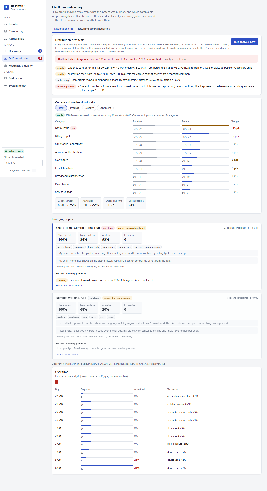
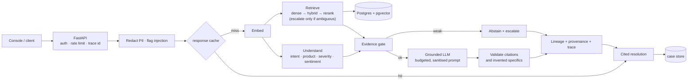
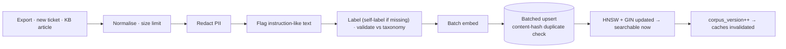
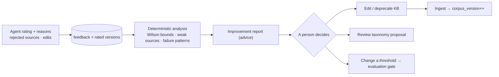
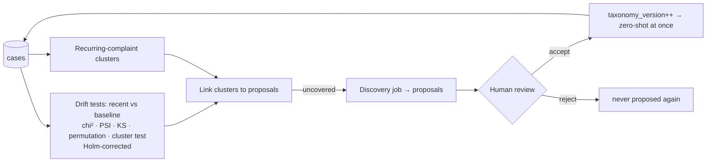

# ResolveIQ: evidence-grounded resolution assistant for telecom support

ResolveIQ turns a raw customer complaint into a **cited, step-by-step resolution** that a support agent can check, built only from previously resolved tickets and
knowledge-base (KB) articles. It understands the complaint semantically, retrieves by meaning rather than keywords, shows exactly which evidence supports each step,
validates every citation, **abstains and escalates** when the evidence is weak, learns from agent feedback through reports a person reviews, and watches for
complaint topics the taxonomy does not cover yet.

It is a production-*oriented* prototype: the engineering around the model (queueing, caching, tracing, drift detection, database tuning, security tests, Kubernetes
manifests) is real and was exercised, but it ran on one laptop with a synthetic corpus. [Section 11](#11-limitations) says exactly what that does and does not show.


*Screenshots are real output of the console against a scratch database: the resolutions are real, the agent feedback is **simulated** from ground truth (`seed_demo_session.py`) and the drift traffic is **synthetic** (`seed_drift_traffic.py`).*

## Demo

https://github.com/user-attachments/assets/aace364f-b5ae-4963-8e58-9a0b4cddb6e4

This is a screen recording of the real console running locally against the scratch demo database (`scripts/demo_env.py`, then `scripts/seed_demo_session.py`), with
`qwen3:4b-instruct` served by Ollama. In order: a broadband complaint is resolved by the live pipeline (a fresh LLM answer, 5.0 s) → understanding → cited steps, and the
sources a step highlights → evidence list → confidence → stage trace and provenance → "not helpful" feedback with a reason and a rejected source → evidence graph → case
replay (model call switched off, so the diff explains the change to an evidence-only answer) → an out-of-domain question that abstains without an LLM call → retrieval
lab → drift monitoring and discovery → feedback and quality → system health. A Playwright script drove the browser and Playwright's page recorder captured it; the caption
bar at the bottom was added by that script, and everything else is the running application. As in the screenshots, the feedback shown in Feedback & quality is
**simulated** from ground truth and the drift traffic (including the smart-home-hub topic) is **synthetic**.

## Rubric Map

Where each assessment criterion is evidenced in this repository. Every link goes to the document section, file or result that supports the claim.

### 1. Problem Background (15 points)
* **The problem, and why keyword search fails:** [section 1](#1-problem) shows that reworded complaints defeat keyword search. It lists what the system must do (parse intent, product, severity and sentiment; retrieve by meaning; cite; abstain on weak evidence; keep working as data and classes change) and the business case: faster first-contact resolution, consistent answers, safer automation.
* **Data designed around the problem, with its limits stated:** [`docs/dataset.md`](docs/dataset.md) describes a synthetic, scenario-driven telecom corpus (250 tickets, 26 KB articles, 25 root-cause scenarios), hand-written gold and blind query sets and leakage control. It also explains [why absolute numbers are optimistic](docs/dataset.md#limitations-please-read).
* **Where the problem is hard:** [the failure-case analysis](docs/evaluation.md#failure-case-analysis) in `docs/evaluation.md` groups the real misses: adjacent root causes with the same symptoms, intent errors that cascade into retrieval, and wrong-source answers that pass validation and that only a person can catch.

### 2. Solution Depth / Production Scale (25 points)
* **A service, not a notebook:** [service topology](docs/architecture.md#0-service-topology) and [section 8](#8-production-deployment). A stateless API and a worker share Postgres (data, pgvector, taxonomy, audit trail, job queue) and Redis. The API enqueues heavy jobs instead of running them. A TLS production Compose stack runs 2 API replicas ([`docs/DEPLOYMENT.md`](docs/DEPLOYMENT.md)).
* **Kubernetes manifests, actually applied:** [`docs/kubernetes.md`](docs/kubernetes.md#1-what-was-tested-and-what-was-not). On a single-node kind cluster, the end-to-end test passed 22 of 22 checks, and 16 of 16 with the LLM down, when re-run on 2026-10-07. A later readiness fix was verified on the container only, not on kind. Running it surfaced [12 findings that were fixed](docs/kubernetes.md#5-findings-from-running-it-on-kubernetes-and-what-was-changed), such as a taxonomy change that never reached the other replicas. This is lab evidence, not proof of production-scale capacity.
* **Measured scale and failure behaviour:** [`docs/production.md` section 1](docs/production.md#1-scale-and-performance) has a Locust load test of one API process: 0% errors, and requests beyond the single LLM slot are answered from evidence only instead of being queued. [`docs/database.md`](docs/database.md#hnsw-configuration-and-the-100-000-vector-experiment) has a 100,000-vector **synthetic** HNSW experiment (recall@10 0.997). At 250 tickets, Postgres correctly uses an exact scan; HNSW is a scale experiment.

### 3. Design Decisions (20 points)
* **Decisions with their reasons and failure behaviour:** [`docs/architecture.md` section 5](docs/architecture.md#5-key-design-decisions). The taxonomy is data, so a new class is one API call. Intent and product use rules + kNN + label prototypes; severity and sentiment use an NLI cue model, because topic similarity cannot recover affect. When evidence is insufficient the LLM is not called (`abstained`). Other failures produce `degraded` or `unreliable` answers instead of invented ones.
* **Defaults chosen by measurement:** [adaptive retrieval: design, tuning, honest result](docs/evaluation.md#adaptive-retrieval-design-tuning-honest-result). Dense retrieval is the default because it won on the recorded splits. Hybrid and cross-encoder reranking can be selected but are not the default, and they are not run on every request. Adaptive retrieval matched dense rather than beating it, so it ships as a bounded, observable option.
* **Trade-offs measured under load:** [`docs/performance.md` section 2.1](docs/performance.md#21-llm-concurrency-limit-priority-1). One LLM slot with a 5 s queue window was chosen from measured alternatives: 1, 2 and 4 slots all deliver about 0.18 answers/s. Extra concurrent users therefore get evidence-only answers instead of an ever-longer queue.

### 4. Code (25 points)
* **Clear module boundaries:** the [module map](docs/architecture.md#3-module-map-backendapp) of [`backend/app`](backend/app) covers ingestion, classification, retrieval, RAG (prompt builder and the [citation validator](backend/app/rag/citations.py)), drift, discovery, quality and the API. The [LLM layer](backend/app/services/llm/base.py) has a total time budget, a concurrency limit, a circuit breaker and a provider chain.
* **Tests that prove behaviour, including hostile input:** [`backend/tests/`](backend/tests) has 21 test modules with 248 top-level test functions (counted in the source; the repository does not record a pass count). [`docs/security.md`](docs/security.md#threats-controls-evidence) maps each threat to its test in [`test_security_hostile.py`](backend/tests/test_security_hostile.py). API access uses an `X-API-Key` with constant-time comparison; there is no per-user identity. [`test_readme_consistency.py`](backend/tests/test_readme_consistency.py) fails if a number in this README disagrees with the result files.
* **CI and reproducibility:** [`.github/workflows/ci.yml`](.github/workflows/ci.yml) runs ruff, then pytest against Postgres + pgvector and Redis. It runs the LLM-free evaluation suites with a regression gate on [`data/eval/thresholds.json`](data/eval/thresholds.json), builds the frontend and images, and validates the Compose and Kubernetes configuration. [`backend/constraints.txt`](backend/constraints.txt) pins package versions to the evaluated ones.

### 5. Evaluation / Monitoring (15 points)
* **Evaluation on held-out, hand-written sets:** [section 9](#9-evaluation) and [`docs/evaluation.md`](docs/evaluation.md) compare keyword, dense, hybrid, reranked and adaptive retrieval. They also report classification on gold and blind sets, grounding (citation validity 1.00) and end-to-end results: 92% resolved with a source from the right root cause, and all 12 out-of-domain complaints abstained. Every number is generated from `data/eval/results/`, and the corpus is synthetic.
* **Statistical drift detection with measured limits:** [`docs/drift.md` section 8](docs/drift.md#8-evidence-the-deterministic-injection-demo) uses chi-square, PSI, KS and permutation tests, Holm-corrected to a 1% false-alarm budget. The injection demo measures 1.0% false alarms and the blind spot for new topics of only 4 to 6 complaints.
* **Runtime monitoring and a feedback loop:** [`docs/observability.md`](docs/observability.md) covers Prometheus metrics, [Grafana dashboards](infra/grafana/dashboards) and [alert rules](infra/prometheus/alerts.yml), plus opt-in OpenTelemetry traces that never carry complaint text. The [Feedback and quality view](docs/console.md#feedback-and-quality) turns agent ratings into an advisory report. In the demo, that feedback is simulated from ground truth.

## Contents
[Demo](#demo) · [Rubric Map](#rubric-map) ·
1 [Problem](#1-problem) · 2 [Semantic understanding](#2-semantic-understanding) · 3 [Hybrid and adaptive retrieval](#3-hybrid-and-adaptive-retrieval) ·
4 [Evidence graph](#4-evidence-graph) · 5 [Grounded RAG](#5-grounded-rag-and-citation-validation) · 6 [Feedback loop](#6-feedback-loop) ·
7 [Drift and evolving taxonomy](#7-drift-and-evolving-topics) · 8 [Production deployment](#8-production-deployment) · 9 [Evaluation](#9-evaluation) ·
10 [Run it](#10-run-it) · 11 [Limitations](#11-limitations) · 12 [Future work](#12-future-work) · [Repository layout](#repository-layout)

## 1. Problem
Agents search past tickets and KB articles by keyword (`router`, `billing`, `speed`). That fails when the same problem is worded differently: *"Internet connection
disconnects every night"* versus *"My broadband keeps dropping around 8 PM each day"*. For each complaint the system must parse it (intent, product, severity,
sentiment), retrieve semantically similar resolved tickets and KB articles, generate a grounded resolution with exact citations, avoid hallucinating when evidence is
weak, and keep working as data and ticket classes evolve. The business case is faster first-contact resolution, consistent answers across agents, and safer automation
(abstention and validation instead of confident guesses).

Data: a synthetic, seeded, scenario-driven telecom corpus (25 root-cause scenarios in the corpus, 250 tickets, 26 KB articles including one retired article; 2 further scenarios are held back as brand-new classes; hand-written gold and blind query sets and out-of-domain
queries). No public dataset was used; see [`docs/dataset.md`](docs/dataset.md) for how it was generated,
how leakage was controlled and why absolute numbers are optimistic.

## 2. Semantic understanding
Intent and product come from an ensemble of keyword rules from the taxonomy, kNN votes over resolved tickets, and label prototypes (mean embedding of each label's
description and examples), which is what lets a brand-new class work before it has history. Severity and sentiment describe how the customer states the impact, so
voting among topic-similar tickets cannot recover them; a pretrained NLI model scores 14 semantic cues and a tiny combiner maps them to labels. The taxonomy is data
(versioned rows, not code): a new class is one API call. Details and the failed alternatives: [`docs/architecture.md`](docs/architecture.md) section 5.

## 3. Hybrid and adaptive retrieval
Strategies share one auditable result shape: `lexical` (Postgres full-text), `dense` (pgvector HNSW cosine), `hybrid` (weighted Reciprocal Rank Fusion), `hybrid_reranked`
(cross-encoder over the fused top 20) and `adaptive`, plus an eval-only in-memory BM25 so the keyword baseline is fair. **Adaptive** always runs the cheap dense search
first and escalates to the hybrid leg and, optionally, a bounded rerank only when the rank 1 versus rank 2 margin says the answer is ambiguous; every decision is
recorded in the response, in a metric and in a trace event. Strategy is selectable per request, and the console's **Retrieval lab** runs all of them side by side on
one complaint, with relevance marked when the ground truth is known.

The honest result, measured and in [section 9](#9-evaluation): on this corpus dense retrieval beats lexical, BM25, hybrid and reranked retrieval, and the tuned adaptive
ladder matches dense rather than beating it. Dense is the default for that reason, not by convention.

## 4. Evidence graph
Every response carries a lineage: complaint, how it was understood, which sources were retrieved and why, which steps cite which sources and how well each is supported,
and the validation checks. The console draws it; clicking a step highlights its evidence and clicking a source shows why it was retrieved. Every citation maps to a source that
was really retrieved (a check on the lineage, and a test), and the graph shows only safe signals (scores, ranks, agreement, coverage, abstention reason), never model reasoning.
Each response also records provenance (model, prompt version and hash, taxonomy, corpus, embedding model, retrieval configuration, generation settings) and a per-stage
trace, so any past case can be **replayed** through today's pipeline and diffed. See [`docs/console.md`](docs/console.md).


## 5. Grounded RAG and citation validation
The top tickets and articles become labelled evidence blocks (`[TKT-1007]`, `[KB-001]`) in a **versioned, token-budgeted prompt**: duplicates collapse, evidence is sanitised
(forged ids, role tokens and instruction-like sentences neutralised), and what was clipped is reported. The model must return JSON with per-step citations. A validator then
(a) removes and reports any cited id that was not retrieved, (b) flags steps with no citation, (c) flags steps the cited text does not support, (d) rejects links, e-mail
addresses, phone numbers and amounts that appear in no cited evidence, and (e) marks the answer `unreliable` and forces escalation when checks fail. If the evidence is
insufficient the LLM is **not called**: the answer is `abstained` with the responsible team. If the LLM is down, slow or busy (all generation slots taken), the answer is `degraded` (shown as "evidence only"): steps copied from the cited past
resolutions. The LLM layer has one total time budget, a concurrency limit, a circuit breaker and a provider chain (Ollama, an OpenAI-compatible endpoint, evidence-only);
a deterministic mode (temperature 0, fixed seed) exists for evaluation and replay. Security tests with hostile tickets, articles and complaints: [`docs/security.md`](docs/security.md).

## 6. Feedback loop
Agents rate a resolution with reasons, rejected sources, a corrected intent and an edited version of the steps; each rating is stored with the pipeline versions it rated.
The **Feedback and quality** view reports helpful and rejection rates, problem intents (ranked by a Wilson lower bound so tiny samples do not top the list), most-rejected
sources, weak KB articles, abstention reasons and failure patterns, and produces a deterministic improvement report. **Nothing is retrained or edited automatically**:
the report is advice for a person. Case replay and the report are described in [`docs/console.md`](docs/console.md).


## 7. Drift and evolving topics
* **New data and classes at runtime.** `POST /api/v1/ingest/ticket|article` makes a document searchable at once; `POST /api/v1/taxonomy/labels` adds a class without retraining or redeploy.
* **Classes nobody named yet.** A worker job clusters recent complaints the corpus explains poorly and proposes new classes or extensions of existing ones (keywords, examples, cohesion); a person accepts or rejects, and an accepted class works zero-shot immediately.
* **Statistical drift detection** ([`docs/drift.md`](docs/drift.md)). The last day is compared with the previous two weeks by chi-square and per-category tests with PSI, KS on evidence strength, a permutation test on the embedding centroid and an exact test for new-topic clusters, each requiring a minimum effect size and Holm-corrected to a 1% false-alarm budget per report. Its limits are stated in the doc, and measured on an injection demo.
* **Recurring complaint clusters** group semantically similar recent complaints (size, representative, intent, time pattern, confidence, examples) and link them to the discovery proposals that cover them. These are support-side recurring complaints, **not** network-incident detection.
* Feedback, drift and discovery meet in one place: a cluster nobody has a proposal for is visible as a gap.



## 8. Production deployment
Two stateless services share Postgres (data, vectors, taxonomy, audit trail and the job queue) and Redis: an interactive **API** and a **worker** (batch ingestion, evaluation, discovery, drift, re-index).
The API never runs heavy jobs; it enqueues them. Implemented and exercised: pooled async Postgres with HNSW and GIN indexes, batched ingestion, Redis response and embedding caches, a shared rate limiter,
request, DB and LLM timeouts, a Prometheus + Grafana setup with alert rules, opt-in OpenTelemetry tracing, an API-key model with a least-privilege database role, Docker Compose (dev and TLS production),
and Kubernetes manifests that were applied to a **single-node kind cluster** and re-verified on the current code (22 of 22 end-to-end checks, 16 of 16 with the LLM down, an in-place schema upgrade). A load test and a 100 000-vector pgvector experiment describe the scale that was actually measured.

* Production runbook: [`docs/DEPLOYMENT.md`](docs/DEPLOYMENT.md) · what is implemented versus recommended: [`docs/production.md`](docs/production.md)
* Kubernetes (what was and was not tested): [`docs/kubernetes.md`](docs/kubernetes.md) · performance experiments: [`docs/performance.md`](docs/performance.md)
* Database engineering (indexes, query plans, HNSW settings, 100k-vector experiment): [`docs/database.md`](docs/database.md)
* Observability (metrics, spans, privacy): [`docs/observability.md`](docs/observability.md)

## Architecture
Module map, data model and design decisions: [`docs/architecture.md`](docs/architecture.md).

**Online resolution path**



**Ingestion path**



**Feedback loop**



**Drift and discovery loop**



## 9. Evaluation
Every number in this section is generated from the files in `data/eval/results/` and `loadtest/results/` by `backend/scripts/render_readme_metrics.py`, and a test fails if this
README and those files disagree. Method, tuning history, failure analysis and caveats: [`docs/evaluation.md`](docs/evaluation.md); the full generated report: [`docs/evaluation_results.md`](docs/evaluation_results.md).

<!-- METRICS:START (generated by backend/scripts/render_readme_metrics.py; do not edit by hand) -->

Recorded on the final code (suites were run on 2026-10-06; the newest write is `2026-10-06T18:49:09+00:00`): 250 tickets, 25 active articles (+ 1 retired); embedding `sentence-transformers/all-MiniLM-L6-v2`, reranker `cross-encoder/ms-marco-MiniLM-L-6-v2`, LLM `ollama:qwen3:4b-instruct`. Query sets: val 50, test 100, gold 101, blind 50, ood 12, evolving 12.

**At a glance**

* **Semantic retrieval beats keyword search** on hand-written complaints: Hit@1 0.91 (dense) versus 0.66 (Postgres full-text) and 0.75 (BM25).
* **Severity and sentiment** (blind hand-written set): accuracy 0.48 to 0.64 and 0.48 to 0.78 with the NLI cue model; intent 0.96.
* **End to end** (141 in-domain, 12 out-of-domain complaints): 92% resolved with a source from the right root cause, 100% of out-of-domain complaints abstained, median latency 4,868 ms.
* **Grounding:** citation validity 1.00, step faithfulness 1.000 (lexical-containment proxy), citation precision against the right root cause 0.91 (evidence-only baseline 0.59).
* **Adaptive retrieval matches dense retrieval, it does not beat it** (MRR difference +0.000 on gold tickets, interval includes zero on every held-out split). It is shipped as a bounded, observable option.
* **Drift detection** (injection demo): 1.0% false alarms with no change; "billing_dispute rises to 40%" found in 30 of 30 trials; a new topic with 10 of 100 recent complaints in 20 of 30, with 4 and 6 complaints in 0 and 2 of 30; for 4 and 6 complaints, below what a 1% alarm can certify, discovery puts a proposal for the topic in front of a reviewer in 4 and 13 of 30 (limits in docs/drift.md).
* **Database:** 100,000 synthetic 384-d vectors, HNSW: recall@10 0.997, p99 2.556 ms, 355 MB; batched ingestion 4.3x faster than per-row transactions.
* **Load (one API process, one laptop):** 18.37 req/s without the LLM at 1 user, 21.12 at 25 users (CPU-bound; errors 0.0%); with the LLM one user gets full answers at 0.24 req/s, and extra concurrent users are served from evidence only rather than queued.

**held-out paraphrases (templated), tickets** (n=100)

| strategy | Hit@1 | Hit@5 | MRR | nDCG@10 | p50 | p95 |
|---|---:|---:|---:|---:|---:|---:|
| keyword (Postgres FTS) | 0.15 | 0.45 | 0.28 | 0.13 | 7.8 ms | 26.9 ms |
| keyword (BM25, in memory) | 0.28 | 0.54 | 0.40 | 0.20 | 1.2 ms | 2.2 ms |
| dense (pgvector) | **0.66** | **0.93** | **0.77** | **0.49** | 1.3 ms | 2.4 ms |
| hybrid (RRF) | 0.58 | 0.91 | 0.72 | 0.42 | 5.9 ms | 17.6 ms |
| hybrid + cross-encoder | 0.57 | 0.90 | 0.71 | 0.42 | 17.6 ms | 37.2 ms |
| adaptive | **0.66** | **0.93** | **0.77** | **0.49** | 1.8 ms | 4.7 ms |

**hand-written gold, tickets** (n=101)

| strategy | Hit@1 | Hit@5 | MRR | nDCG@10 | p50 | p95 |
|---|---:|---:|---:|---:|---:|---:|
| keyword (Postgres FTS) | 0.66 | 0.90 | 0.76 | 0.46 | 4.1 ms | 19.3 ms |
| keyword (BM25, in memory) | 0.75 | 0.93 | 0.82 | 0.50 | 1.0 ms | 1.3 ms |
| dense (pgvector) | **0.91** | **0.98** | **0.94** | **0.65** | 1.6 ms | 2.6 ms |
| hybrid (RRF) | **0.91** | **0.98** | 0.93 | 0.63 | 6.2 ms | 12.3 ms |
| hybrid + cross-encoder | **0.91** | **0.98** | 0.93 | 0.64 | 18.4 ms | 50.9 ms |
| adaptive | **0.91** | **0.98** | **0.94** | **0.65** | 3.4 ms | 14.7 ms |

Quality columns are deterministic and reproduce exactly between runs. Latencies are single-process timings on a shared laptop: the p50s are stable, but a p95 of a few milliseconds moves several-fold between runs with whatever else the machine is doing, so compare strategies by p50.

**Adaptive retrieval** (margins: tickets 0.0, articles 0.0181; rerank rung off, MMR off; chosen on val + test (150 templated queries), judged on gold, blind). Share of queries that stopped at each rung, and the paired-bootstrap difference to dense retrieval (MRR, 95% interval):

| split | stopped at dense | at hybrid | at rerank | adaptive minus dense | queries adaptive better / worse |
|---|---:|---:|---:|---:|---:|
| gold tickets | 100% | 0% | 0% | +0.000 (+0.000 to +0.000) | 0 / 0 |
| gold articles | 92% | 8% | 0% | -0.014 (-0.037 to +0.001) | 0 / 2 |
| blind tickets | 100% | 0% | 0% | +0.000 (+0.000 to +0.000) | 0 / 0 |
| blind articles | 90% | 10% | 0% | +0.012 (+0.000 to +0.033) | 1 / 0 |

**Classification accuracy** (`gold` = hand-written, `blind` = hand-written after the affect model was frozen; `before` = rules + kNN for every dimension):

| split | classifier | intent | product | severity | sentiment |
|---|---|---:|---:|---:|---:|
| gold (101) | before | 0.95 | 0.98 | 0.48 | 0.39 |
| gold (101) | shipped | 0.95 | 0.98 | 0.65 | 0.66 |
| blind (50) | before | 0.96 | 0.92 | 0.48 | 0.48 |
| blind (50) | shipped | 0.96 | 0.92 | 0.64 | 0.78 |

**Grounded generation** (ollama:qwen3:4b-instruct, 137 answers; evidence-only baseline 38 answers):

| metric | LLM | evidence only |
|---|---:|---:|
| step faithfulness | 1.0000 | 1.0000 |
| response hallucination rate | 0.0% | 0.0% |
| citation validity | 1.00 | 1.00 |
| citation coverage | 1.00 | 1.00 |
| citation precision vs gold scenario | 0.91 | 0.59 |
| gold-step recall | 0.91 | 0.76 |
| LLM judge, 20 answers (1 to 5; a qwen3:4b-instruct self-judge) | faithfulness 4.9, relevance 5.0 | n/a |

**End to end** (141 in-domain + 12 out-of-domain complaints through the full pipeline):

| metric | value |
|---|---:|
| resolved | 97% |
| resolved with a source from the right scenario | 92% |
| false abstention (in-domain) | 2.8% |
| out-of-domain complaints abstained | 100% |
| pipeline errors | 0 |
| latency p50 / p95 (LLM generation dominates) | 4,868 ms / 5,917 ms |
| LLM tokens per generated answer, prompt / completion (mean; p95), 137 answers | 1,491 / 313 (1,637 / 390) |

**Recurring-complaint clusters** (301 labelled complaints from 25 root causes in 9 intents; average linkage on the stored query embeddings). Purity is the share of complaints in a cluster that agree with the cluster's majority label; a root cause counts as recovered when one cluster is at least 70% that cause and holds at least half of its complaints. The application uses distance 0.55.

| cosine distance | clusters | complaints clustered | mean size | purity vs intent | purity vs root cause | ARI vs root cause | root causes recovered |
|---|---:|---:|---:|---:|---:|---:|---:|
| 0.45 | 43 | 59% | 4.2 | 0.93 | 0.84 | 0.23 | 4 of 25 |
| 0.55 | 37 | 90% | 7.3 | 0.88 | 0.75 | 0.48 | 14 of 25 |
| 0.65 | 15 | 97% | 19.5 | 0.72 | 0.41 | 0.28 | 3 of 25 |

With 30 complaints from 3 never-seen classes mixed in (distance 0.55): 3 of 3 of those classes came out as their own cluster.

**Evolving data** (12 queries about 2 new intents; no restart): Hit@5 0.00 before ingestion, 0.92 after ingesting 2 articles and a batch of 12 tickets in 0.1 s.

**Emerging-class discovery** (21 complaints from 3 never-seen classes among 251 known): the abstention gate alone catches 24% of the novel complaints, the candidate filter 86%; clustering recovered 3 of 3 classes, proposal precision 0.60; after a person accepts the proposals, held-out complaints are routed correctly 0% → 56% with no resolved tickets for those classes.

**Drift detection** (injection demo, 30 trials per scenario, no database, deterministic seeds; `python -m app.evaluation.drift_demo`):

| scenario | alerts | rate |
|---|---:|---:|
| no change, 300 / 100 requests | 2 of 200 reports | 1.0% (95% 0.3% to 3.6%) |
| no change, 140 / 70 requests | 2 of 200 reports | 1.0% (95% 0.3% to 3.6%) |
| billing_dispute rises to 33% | 10 of 30 reports | 33% (95% 19% to 51%) |
| billing_dispute rises to 40% | 30 of 30 reports | 100% (95% 89% to 100%) |
| 6 of 100 (6%) are a new topic | 2 of 30 reports | 7% (95% 2% to 21%) |
| 10 of 100 (10%) are a new topic | 20 of 30 reports | 67% (95% 49% to 81%) |
| three new topics at once, 8 complaints each (24% of recent traffic); detected = at least one recovered | 17 of 30 reports | 57% (95% 39% to 73%) |
| every recent complaint arrives in chat-widget style (abbreviated, lower case) | 25 of 30 reports | 83% (95% 66% to 93%) |

**Small new topics: alarm versus review queue** (same windows). A pure cluster of 4 recent complaints cannot reach p < 1% at this window size, so the alarm, with its 1% false-alarm budget, cannot certify it; discovery has no alarm budget and puts a proposal in front of a person instead, at the cost of review load:

| scenario | drift alarm | discovery proposal for the topic (95%) | other proposals per window |
|---|---:|---:|---:|
| 4 of 100 complaints are a new topic | 0 of 30 | 4 of 30 (5% to 30%) | 0.6 |
| 6 of 100 complaints are a new topic | 2 of 30 | 13 of 30 (27% to 61%) | 0.63 |
| nothing changed | - | - | 0.57 |

**pgvector at scale (SYNTHETIC vectors, not a production benchmark):** 100,000 x 384 vectors, HNSW m=16, ef_construction=64: build 22.4 s (serial), 355 MB on disk (195 MB index); at ef_search 100: p50 1.422 ms, p95 1.976 ms, p99 2.556 ms, recall@10 0.9972 versus exact search. synthetic vectors (Gaussian mixture), no text, one Postgres container on a laptop, client and server share the machine.

**Ingestion at the database layer** (2000 tickets with random embeddings, so the embedding model is excluded): 166 tickets/s with one transaction per ticket versus 717 tickets/s in one batched transaction (4.3x); re-running the same batch updates in place (2000 updated, 0 created).

**Load test** (suite `2026-10-06-final`, commit `9b6f646`, recorded as `2e68d3d` before the history was rewritten; the working tree had uncommitted changes outside the request path; the request path has not changed since): Closed-loop Locust load test of one API process (suite 2026-10-06-final): Intel(R) Core(TM) i9-14900HX, 31.7 GB RAM, GPU NVIDIA GeForce RTX 4070 Laptop GPU, 8188 MiB, 576.28, shared by the LLM, NLI and embedding models; Postgres and Redis in Docker on the same machine. Full tables: loadtest/results/2026-10-06-final/SUMMARY.md.

| scenario | users | OK req/s | p50 | p95 | p99 | errors | answered from evidence only |
|---|---:|---:|---:|---:|---:|---:|---:|
| no LLM (evidence-only mode) | 1 | 18.37 | 54.0 ms | 63.3 ms | 67.5 ms | 0.0% | 89.9% |
| no LLM (evidence-only mode) | 5 | 21.14 | 235 ms | 256 ms | 325 ms | 0.0% | 89.8% |
| no LLM (evidence-only mode) | 10 | 20.8 | 476 ms | 533 ms | 571 ms | 0.0% | 90.0% |
| no LLM (evidence-only mode) | 25 | 21.12 | 1,166 ms | 1,257 ms | 1,309 ms | 0.0% | 88.7% |
| full pipeline, local LLM | 1 | 0.24 | 4,882 ms | 6,671 ms | 6,892 ms | 0.0% | 0.0% |
| full pipeline, local LLM | 5 | 0.94 | 5,139 ms | 10.4 s | 11.4 s | 0.0% | 64.3% |
| full pipeline, local LLM | 10 | 2.04 | 5,142 ms | 9,384 ms | 11.5 s | 0.0% | 76.5% |
| LLM unreachable | 5 | 17.57 | 235 ms | 255 ms | 358 ms | 0.0% | 90.6% |

One machine, one API replica, synthetic users replaying the evaluation complaints; client and server compete for the same CPU and GPU. It describes this setup, not a deployed system, and says nothing about multiple replicas or a dedicated LLM tier. With a concurrency limit of 1 on the single local GPU, requests beyond the first are answered from evidence only (the 'evidence-only' share) rather than queued, which is the designed behaviour.

<!-- METRICS:END -->

## 10. Run it
Requirements: Python 3.11, Node 20+, Docker, and optionally Ollama (without an LLM the system still answers, from evidence only, with status `degraded`). Docker Desktop needs
roughly 12 GB of memory for the Kubernetes demo and far less for Compose.

**Models.** The first start downloads three Hugging Face models (about 1.05 GB in total, once, into `~/.cache/huggingface`; set `HF_HUB_OFFLINE=1` afterwards to never contact the Hub). The
backend Docker image bakes them in. The LLM is pulled separately.

| model | role | download | how to change or turn off |
|---|---|---:|---|
| `sentence-transformers/all-MiniLM-L6-v2` | embeddings (384-d) for retrieval, classification, clustering, drift | 91 MB | `EMBEDDING_MODEL` + `EMBEDDING_DIM`, then re-index ([`docs/production.md`](docs/production.md)) |
| `cross-encoder/ms-marco-MiniLM-L-6-v2` | reranker for `hybrid_reranked` and the adaptive ladder | 91 MB | `RERANKER_MODEL`, `RERANKER_ENABLED=false` |
| `MoritzLaurer/deberta-v3-large-zeroshot-v2.0` | NLI cues for severity and sentiment (combiner: `data/models/affect_v1.json`) | 870 MB (fp16; about 2.5 GB RAM in float32) | `AFFECT_ENABLED=false` (rules + kNN fallback, lower accuracy), `AFFECT_DEVICE=cpu\|cuda` |
| `qwen3:4b-instruct` via Ollama | grounded generation | 2.5 GB | `ollama pull qwen3:4b-instruct`; `LLM_PROVIDERS=ollama,openai_compat` with `OPENAI_COMPAT_*` for vLLM, LM Studio or a hosted API; `LLM_PROVIDERS=mock` for tests |

The recorded results used the Hub snapshots `1110a24` (MiniLM), `233902d` (reranker) and `cf44676` (DeBERTa). `backend/constraints.txt` pins every Python package to the versions those results were
produced with; install with it to reproduce them, without it to get newer libraries.

```bash
cp .env.example .env                       # passwords here must match DATABASE_URL / DATABASE_ADMIN_URL
docker compose up -d db redis
cd backend && pip install -r requirements-dev.txt -c constraints.txt   # add torch from https://download.pytorch.org/whl/cpu first for a CPU-only machine
python -m app.db.migrate                    # schema, indexes, least-privilege grants
python scripts/seed.py                      # taxonomy + 250 tickets + 26 articles through the ingestion pipeline
python scripts/dev_server.py                # API on http://127.0.0.1:8100 (Windows-safe event loop)
cd ../frontend && npm install && npm run dev   # console on http://localhost:5174 (proxies /api; Vite listens on localhost, which can be IPv6 only)
```
Use `127.0.0.1`, not `localhost`, for Postgres on Windows (IPv6 resolution can hang). On Windows, clone into a short path or run `git config --global core.longpaths true` first: the raw
load-test files have paths of up to 122 characters, and checkout fails with "Filename too long" under a clone directory longer than about 135 characters (observed in the fresh-clone test).
`docker-compose.yml` fixes the project name to `resolveiq`, so a second checkout on the same machine shares the first one's containers and database volume unless started with
`docker compose -p <other-name>` and different host ports in its `.env`.

**Demo flow** (from `backend/`; it uses a scratch copy of the database so demo data never lands in your development database)
```bash
python scripts/demo_env.py setup                # copies the seeded dev database to resolveiq_demo and adds synthetic drift traffic incl. a synthetic "smart-home hub" incident
python scripts/demo_env.py api                  # API on :8100 against the copy (auth off, jobs inline); in another terminal: cd ../frontend && npm run dev
python scripts/seed_demo_session.py --n 30 --novel 10 --force --analyze   # real resolutions of labelled complaints; the feedback is SIMULATED from ground truth and labelled so; then runs a drift analysis and a discovery job
# open http://localhost:5174:  Resolve -> click a step -> Open as case -> Replay case -> Retrieval lab -> Drift monitoring -> Feedback & quality
python scripts/ui_smoke.py --ui http://localhost:5174 --shots ../docs/screenshots   # drives every view in a real browser and regenerates the screenshots (pip install playwright)
python scripts/demo_env.py drop                 # remove the scratch database
```

**Tests and evaluation** (from `backend/`)
```bash
python -m pytest tests -q                    # DB tests use a throw-away database; needs `docker compose up -d db redis`
python -m app.evaluation.run                 # every suite on the current code (about 15 minutes with a GPU and Ollama); writes data/eval/results/latest.json + docs/evaluation_results.md
python -m app.evaluation.gate                # CI gate: exit 1 if a metric fell below data/eval/thresholds.json
python scripts/render_readme_metrics.py      # regenerate the numbers in this README (and docs/evaluation.md) from the result files; --check only verifies
python -m app.evaluation.drift_demo          # drift detection on injected scenarios (no database)
python scripts/pgvector_scale_benchmark.py   # 100 000 x 384 synthetic vectors: build time, p50/p95/p99, recall, storage
python scripts/db_review.py                  # EXPLAIN ANALYZE of the console and job queries
python scripts/ingest_benchmark.py           # per-row versus batched ingestion at the database layer
python ../loadtest/run_loadtest.py --suite mytest --scenarios no_llm llm --levels 1 5 10 --duration 60 && python ../loadtest/summarize.py mytest   # Locust; see loadtest/README.md
```

**Deployment** (from the repository root)
```bash
python deploy/gen_secrets.py --domain support.example.com --email ops@example.com            # random secrets and API keys -> .env.prod
docker compose --env-file .env.prod -f docker-compose.prod.yml up -d --build                   # TLS proxy, 2 API replicas, Postgres, Redis, UI
python deploy/smoke_test.py https://support.example.com --api-key <agents key>                 # must print SMOKE TEST PASSED
bash k8s/local/deploy.sh --ingress && python k8s/local/e2e_test.py --ingress                   # kind cluster: manifests applied, 22 checks (docs/kubernetes.md)
docker compose up -d --build                         # development stack; add --profile monitoring for Prometheus :9091 and Grafana :3001
```
Host ports are offset (5433, 6380, 8100, 5174, 9091, 3001) so they do not clash with other local stacks.

**API** (interactive docs at `/docs` outside production; auth is `X-API-Key` when `API_KEYS` is set)

| Endpoint | Purpose |
|---|---|
| `POST /api/v1/resolve` | complaint → classification, sources, cited steps, confidence, escalation, lineage, provenance, stage trace |
| `GET /api/v1/search` | inspect retrieval with any strategy |
| `POST /api/v1/ingest/ticket` · `/article` · `/tickets/batch` (202 + job) · `GET /jobs/{id}` | ingestion |
| `GET/POST /api/v1/taxonomy`, `/taxonomy/labels`, `/taxonomy/discover`, `/taxonomy/proposals/{id}/accept\|reject` | versioned taxonomy and class discovery |
| `GET /api/v1/monitoring/drift`, `/drift/status`, `POST /drift/run`, `GET /drift/history`, `/drift/timeline` | label-free signals and statistical drift analysis |
| `GET /api/v1/cases`, `/cases/{id}`, `POST /cases/{id}/replay`, `/cases/{id}/compare` | case store, replay and strategy comparison |
| `POST /api/v1/retrieval/compare`, `GET /retrieval/examples` | retrieval lab |
| `GET /api/v1/clusters/recurring` | recurring complaint clusters |
| `POST /api/v1/feedback`, `GET /quality/summary`, `/quality/report` | feedback and its analysis |
| `GET /api/v1/system/status`, `/system/db`, `/evaluation/results` | health, database report, recorded results |
| `POST /api/v1/evaluate`, `GET /evaluate/{job}` · `POST /articles/{id}/deprecate` · `GET /tickets`, `/articles`, `/stats` | evaluation job, KB retirement, browsing |
| `GET /health`, `/health/ready`, `/metrics` | liveness, readiness, Prometheus |

## 11. Limitations
* **Synthetic corpus.** 250 tickets from 25 scenarios; the hand-written gold and blind sets cover the same root causes in new wording and have a single labeller. Absolute numbers are optimistic, and severity and sentiment labels carry a few points of noise.
* **Adaptive retrieval did not beat dense** here. Its mechanism, bounds and audit trail work and are tested; its benefit would have to be shown on a corpus where dense retrieval is weaker.
* **Severity and sentiment** are better than before but remain the weakest outputs, and sentiment degrades on lower-cased or truncated text. The NLI model needs about 2.5 GB RAM and is slow on CPU.
* **Abstention** catches unrelated requests but only a minority of complaints from near-neighbour classes the corpus does not cover; discovery needs recurrence and its proposals are partly noise, so a human reviews them. Drift detection has measured blind spots at low counts ([`docs/drift.md`](docs/drift.md)).
* **Feedback in the demo is simulated** from ground truth to show the views working; no real agent rated anything. The recurring clusters are support-side groups, not network incidents.
* **Scale evidence is bounded.** The load test is one API process on one laptop sharing a GPU with the LLM; the pgvector experiment uses synthetic vectors on one container; Kubernetes ran on a single-node kind cluster (the end-to-end and LLM-down checks were repeated on the current code; the rolling-restart and policy checks were not), with no managed database and no real TLS certificate. None of it is a production-scale claim, and no real traffic was served.
* **Security** is tested against hostile inputs with deliberately misbehaving fake models, not a red-team campaign; poisoned-but-not-instruction-like content is not detected ([`docs/security.md`](docs/security.md)). PII redaction is regex-based (no names or addresses). Auth is a shared key per role, with no per-user identity or tenants.
* The hallucination metrics are deterministic proxies and the LLM judge is a 4B model judging itself. Single language, one issue per complaint, no conversation context.

## 12. Future work
Real ticket data and several labellers; a fine-tuned or distilled affect model; a fine-tuned bi-encoder or similarity-trained reranker; measuring adaptive retrieval on a harder corpus; per-tenant isolation and OIDC; a red-team
exercise against the prompt-injection controls; KEDA autoscaling of workers on queue depth; load tests with more than one replica and a dedicated LLM tier; a managed-Kubernetes deployment with real TLS.

## Repository layout
`backend/app` (api, cases, classification, clusters, discovery, drift, evaluation, ingestion, lab, quality, rag, retrieval, services, system, db, core, observability) · `backend/tests` · `backend/scripts` (dataset, seed, benchmarks, demo and smoke scripts) ·
`frontend` (React console) · `data/{raw,processed,eval}` · `docs/` · `loadtest/` · `infra/` (Postgres init, Prometheus, Grafana) · `deploy/` (secrets, smoke test, backup, Caddyfile) · `k8s/base/` · `k8s/local/` (kind) · `.github/workflows/ci.yml` · `docker-compose.yml` · `docker-compose.prod.yml` · `.env.example` · `.env.prod.example`.
