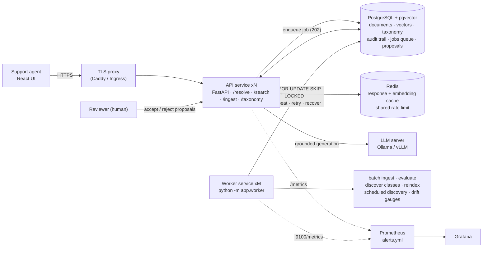
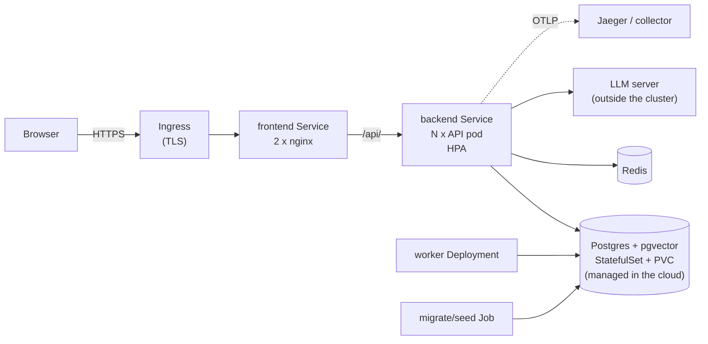
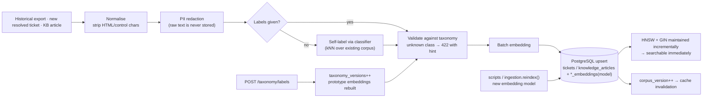
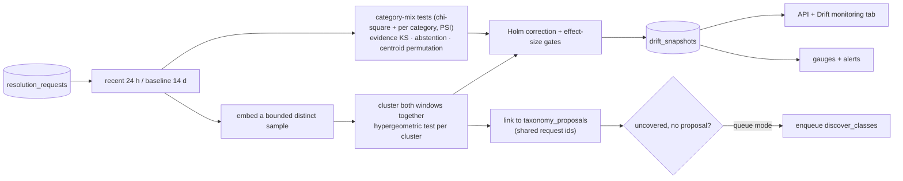
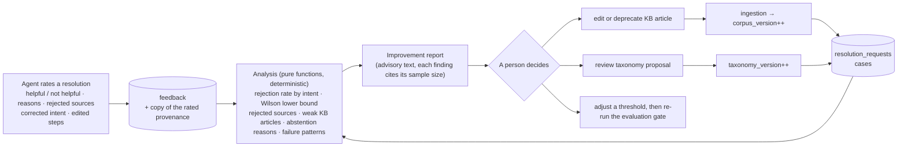
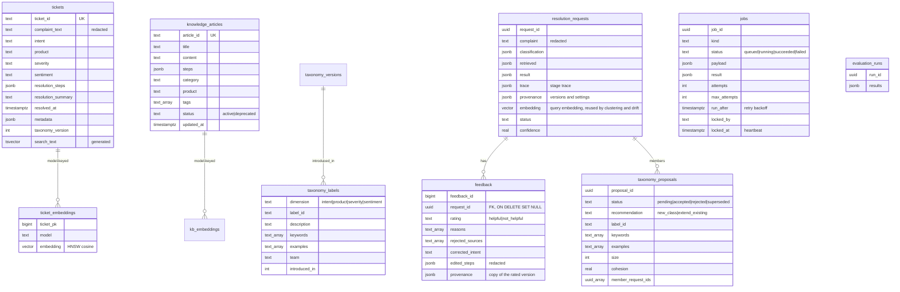

# Architecture

ResolveIQ is two stateless Python services - an interactive **API** (FastAPI) and a **worker** (batch ingestion, evaluation,
class discovery, re-index) - sharing PostgreSQL + pgvector (single source of truth for documents, vectors, taxonomy, audit
trail **and the job queue**), Redis (cache / rate limiting), local embedding / reranker / NLI models, and a pluggable LLM provider
chain (Ollama by default). Everything runs offline; no paid API is required.

## 0. Service topology

Why two services: the API must stay responsive (p95 of `/resolve`), while batch embedding, evaluation and clustering are
CPU-heavy, bursty and retryable. They scale independently (more API replicas for traffic, more workers for backlog) and a
crashing job can never take interactive traffic down. The queue is Postgres itself (`SELECT ... FOR UPDATE SKIP LOCKED`) - one
fewer system to run at this scale; swapping to SQS/Redis Streams later only touches `Repository.claim_job/complete_job/fail_job`.
`JOB_EXECUTION=inline` runs the same handlers inside the API process for single-process development and tests.

## 0b. Kubernetes topology (as deployed and tested on kind; see [`kubernetes.md`](kubernetes.md))

One image, three roles (API, worker, migrate Job). Configuration is a ConfigMap plus a Secret consumed with `envFrom`; the namespace enforces the
`restricted` pod-security level; a default-deny NetworkPolicy set opens only frontend → backend, backend/worker/migrate → Postgres, Redis, the LLM
port and OTLP, and Prometheus → `/metrics`. Because the API is replicated, **every in-process cache must be safe across replicas**: the response cache
and rate limiter live in Redis, the corpus is versioned in Postgres, and the taxonomy (cached with its prototype embeddings in each process) is
re-read when `taxonomy_versions` moves (`TAXONOMY_SYNC_SECONDS`, default 10 s). Before that sync existed, a class accepted on one replica was invisible
to the others until they restarted; the Kubernetes test found it. `LLM_MAX_CONCURRENCY` is likewise a per-replica limit.

## 1. Online resolution path: `POST /api/v1/resolve`

```mermaid
flowchart TD
    UI["Client / React console"] -->|"complaint"| API["FastAPI API<br/>auth · rate limit · timeout · trace id"]
    API --> PRE["Pre-processing<br/>normalise · PII redaction · injection flag"]
    PRE --> CACHE{"Redis response cache<br/>key = corpus + taxonomy version + prompt hash + model + mode + text"}
    CACHE -- hit --> OUT
    CACHE -- miss --> EMB["Embedder<br/>MiniLM-L6 · query-embedding cache"]
    EMB --> CU["Complaint understanding (concurrent with retrieval)<br/>intent/product: rules + kNN + label prototypes<br/>severity/sentiment: NLI cue model + learned combiner"]
    EMB --> RET
    subgraph RET["Retrieval layer: strategy = lexical | dense | hybrid | hybrid_reranked | adaptive"]
        direction TB
        D1["1. dense search (pgvector HNSW)"] --> M{"rank 1 clearly ahead of rank 2?<br/>(bounded, configurable margin)"}
        M -- "yes: stop" --> SEL
        M -- "no: escalate" --> H["2. hybrid: add the lexical leg, RRF fusion"]
        H --> G{"fused top still tied?<br/>(rerank rung is off by default)"}
        G -- "yes" --> RR["3. cross-encoder rerank of the top N"]
        G -- "no" --> SEL
        RR --> SEL["select + optional MMR diversity"]
    end
    CU -. "optional product filter" .-> RET
    RET --> EV["Evidence builder + sufficiency gate<br/>similarity · rerank · intent consensus"]
    EV -- "insufficient" --> ABS["Abstain + escalate to specialist team<br/>(LLM is not called)"]
    EV -- "sufficient" --> PB["Prompt builder<br/>sanitise evidence · collapse duplicates · token budget · version + hash"]
    PB --> LLM["Grounded LLM generation<br/>Ollama → OpenAI-compatible → evidence-only<br/>total time budget · concurrency limit · circuit breaker"]
    LLM --> CV["Citation validation<br/>ids ⊂ retrieved · per-step support · invented-specifics check"]
    CV -- "fails" --> UNREL["Mark unreliable + force escalation"]
    CV -- "passes" --> LIN
    UNREL --> LIN["Lineage + provenance<br/>evidence graph · stage trace · versions"]
    ABS --> LIN
    LIN --> OUT["Response<br/>classification · sources · steps + citations · confidence · lineage · provenance · trace"]
    OUT --> AUD[("resolution_requests<br/>case: trace · provenance · lineage · query embedding")]
    API -. "metrics · OTLP spans" .-> PROM["Prometheus · Grafana · Jaeger"]
```

Every response records, in one place, what produced it: the stage trace (latency and status of preprocess, cache, embed, classify, retrieve, rerank, evidence, generate,
validate), the provenance (pipeline, model, prompt version and hash, taxonomy and corpus versions, embedding model, retrieval configuration, generation settings, adaptive
decisions) and the lineage (complaint → understanding → retrieved sources → steps → checks). That record is the case that the console replays and diffs.

## 2. Data path: ingestion / evolving data

## 2b. Evolving classes: discovery loop

```mermaid
flowchart LR
    REQ[("resolution_requests<br/>(redacted audit trail)")] --> SEL["Select candidates<br/>abstained OR evidence confidence &lt; 0.80<br/>last 30 days · not already reviewed · de-duplicated"]
    SEL --> EMB2["Embed + nearest resolved tickets"]
    EMB2 --> CL["Average-linkage clustering<br/>cosine distance 0.55 · min size 4"]
    CL --> KW["c-TF-IDF keywords vs corpus background<br/>exemplars = closest to centroid"]
    KW --> DEC{"members close to existing tickets?<br/>(mean top-1 cosine &gt;= 0.60)"}
    DEC -- "no" --> NEW["Proposal: NEW CLASS"]
    DEC -- "yes, one owner intent" --> EXT["Proposal: EXTEND EXISTING class"]
    DEC -- "yes, no owner" --> DROP["Drop: tone / format artefact"]
    NEW --> PR[("taxonomy_proposals<br/>pending")]
    EXT --> PR
    PR --> HUM{"Human review<br/>GET /taxonomy/proposals"}
    HUM -- "accept" --> TAX["add_label / extend_label<br/>taxonomy_version++ · prototypes rebuilt<br/>cache invalidated"]
    HUM -- "reject" --> BLK["members never proposed again"]
    TAX --> NEXT["Class works zero-shot immediately;<br/>kNN strengthens as resolved tickets arrive"]
```

The job is advisory by design: a model must not silently invent support categories that route customers to teams.
Candidates are a deliberately noisy filter (single-request novelty detection reaches only AUC ~0.8); recurrence is what
turns noise into signal - a real new topic forms a tight cluster, scattered false positives do not.

## 2c. Drift monitoring

Runs in the worker (job `drift_analysis`), never in the API. The fast SQL-only layer (`observability/drift.py`) keeps feeding the Prometheus gauges every 5 minutes; this layer adds significance, embeddings and the link to discovery. Details, thresholds and the evaluation: [`drift.md`](drift.md).

## 2d. Feedback loop

Nothing in this loop is automatic. The report names weak spots; it does not retrain a model, rewrite a document, change a label or promote a proposal. That is deliberate:
a feedback signal from a handful of agents is noisy and can be gamed, so a change to what customers are told needs a reviewer and the evaluation gate. What the loop does
guarantee is that every rating is attached to the exact pipeline versions it rated, so a later change cannot rewrite history.

## 3. Module map (`backend/app`)

| Package | Responsibility |
|---|---|
| `api/` | Thin routes, API-key auth + rate limiting dependencies |
| `core/` | Settings (env only), JSON logging with trace id (and OTel ids when tracing is on), errors, PII redaction, text hygiene |
| `db/` | Pooled async repository (all SQL), forward-only migrations, least-privilege grants |
| `classification/` | `Taxonomy` (DB-backed, versioned), strategies (rules / kNN+prototype / LLM zero-shot), `affect.py` (NLI cue model for severity + sentiment), ensemble |
| `discovery/` | Emerging-class discovery: pure clustering + proposal builder (`clustering.py`), service with review actions (`service.py`) |
| `jobs.py`, `worker.py` | Job handlers shared by API-inline and worker modes; the worker loop (claim, heartbeat, retry, recovery, scheduling) |
| `retrieval/` | Strategy registry, RRF fusion, MMR, IDF-pruned lexical query, cross-encoder, in-memory BM25 (eval-only baseline), the adaptive escalation ladder |
| `rag/` | Evidence selection + sufficiency gate, `prompts.py` (versioned, token-budgeted, sanitised prompt), generator (LLM + extractive fallback), citation validator, `lineage.py` (evidence graph), pipeline with stage trace and provenance |
| `ingestion/` | Clean → redact → label → embed → upsert; bulk path; re-index |
| `services/` | Embedding service, Redis cache, LLM provider abstraction (Ollama / OpenAI-compatible / mock), service container |
| `evaluation/` | Metrics, datasets, suites (classification, retrieval, robustness, adaptive, clustering, rag, e2e, evolving, discovery), recorded-results reader (`summary.py`), tuning (validation split only), regression `gate.py`, report generator, CLI |
| `observability/` | Prometheus metric definitions; `drift.py` label-free production drift signals (fast layer) |
| `cases/` | Case store view (list, detail with trace, provenance, lineage, sources, feedback), replay through the current pipeline, and the structured diff (`diff.py`) |
| `lab/` | Retrieval lab: one complaint through every strategy, with relevance when ground truth is known |
| `quality/` | Feedback persistence and the pure, deterministic analysis and improvement report (`analysis.py`) |
| `clusters/` | Recurring-complaint clusters on stored query embeddings (`engine.py`), linked to discovery proposals and drift clusters |
| `system/` | Status (dependencies, versions, LLM circuit, queue, drift freshness) and database health (`health.py`: sizes, index use, HNSW settings, embedding coverage, integrity) |
| `drift/` | Statistical drift detection: pure tests (`stats.py`), the explainable report and new-topic clusters (`detect.py`), the worker-side service that loads windows, embeds a sample, links proposals and stores snapshots (`service.py`) |

## 4. Data model

## 5. Key design decisions

**Classification is data-driven, not code-driven.** Labels (and their keywords, descriptions, examples, escalation team)
live in `taxonomy_labels`. Three strategies produce probability mass per label and are blended per dimension:
*rules* (taxonomy keywords - deterministic, instant, strong on explicit cues such as severity wording),
*kNN + prototypes* (similarity-weighted votes from the resolved-ticket corpus plus a mean embedding of each label's
description/examples - this is what lets a brand-new class work before it has history), and an *LLM zero-shot*
fallback used only when the ensemble confidence is low. A new class is a `POST /api/v1/taxonomy/labels`: no retraining,
no redeploy; `taxonomy_versions` records every change and each ticket stores the version it was labelled under.

**Severity and sentiment use a different mechanism than intent.** They describe *how the customer states the impact*, not the
topic, so voting among topic-similar past tickets (the old kNN approach, 0.48 / 0.48 accuracy on blind hand-written text)
cannot recover them. `AffectModel` scores 14 semantic cues ("the problem is affecting the customer's job", "there is a risk to
health or safety", "the customer says it is not urgent", ...) with a pretrained NLI model and maps the cue vector to labels with
a tiny logistic combiner trained on the synthetic tickets (`scripts/train_affect.py`). The NLI model supplies the language
understanding, so the combiner generalises to hand-written text (blind: 0.64 / 0.78). It degrades to the rule/kNN ensemble if
the model or artifact is missing or was trained for a different model/cue set (hash check), and runs concurrently with
retrieval (about 40 ms on GPU, 1.2 s on CPU float32). int8 quantisation was tried and rejected: it collapses accuracy.

**Retrieval strategies are interchangeable and benchmarked independently** (`lexical`, `bm25` (eval-only), `dense`,
`hybrid`, `hybrid_reranked`) and share one result shape (`source_type, source_id, score, rank, retrieval_method,
metadata, per-stage scores`). Candidate generation (pgvector HNSW cosine / Postgres FTS) is fused with weighted
Reciprocal Rank Fusion, optionally reranked by a cross-encoder and blended back with the fused score. The default
strategy is chosen from validation-split evidence (see `docs/evaluation.md`), not from convention.

**Abstention is a first-class outcome.** An evidence-sufficiency score combines best cosine similarity, reranker
probability (when available) and intent consensus among the top tickets; below `ABSTAIN_THRESHOLD` (calibrated on
validation data against out-of-domain complaints) the LLM is never called and the response is an explicit escalation
to the right team.

**Grounding is verified after generation, not trusted.** The prompt restricts the model to the evidence and a JSON
schema; the validator then (1) strips and reports any citation id that was not retrieved, (2) flags steps with no
citation, (3) flags steps whose text is not supported by the cited evidence (embedding similarity or lexical containment),
and (4) downgrades the response to `unreliable` and forces escalation when checks fail.

**Retrieval escalates only when it has to.** The `adaptive` strategy always runs the cheap dense search first and looks at the margin between rank 1 and rank 2. A clear
lead stops there; a near tie escalates to a hybrid leg (a lexical search reformulated with terms the best candidates share, fused with RRF) and, if configured, a bounded
cross-encoder rerank. Thresholds are settings (`ADAPTIVE_*`) and every decision (stage, signal, threshold, escalate or stop, why) is recorded in the provenance, in the
`resolveiq_adaptive_retrieval_stages_total` metric and as span events. Measured honestly: on this corpus the tuned ladder matches dense retrieval rather than beating it
(see [`evaluation.md`](evaluation.md)), because dense is already strong and the signals available at escalation time did not predict which queries dense would get wrong.
The mechanism, the budget and the audit trail are what the code provides; a corpus where dense is weaker is where it would pay.

**Every answer is reproducible and explainable from its record.** `PROMPT_VERSION` and a hash of the system prompt, the model and provider, the taxonomy and corpus versions,
the retrieval configuration and the generation settings are stored with each case and are part of the response-cache key, so changing any of them cannot serve a stale
answer. A deterministic mode (temperature 0 and a fixed seed) exists so that replaying a case isolates what changed in the pipeline from sampling noise. The prompt is
built under a token budget: duplicate resolutions are collapsed to a pointer, sources are clipped lowest-rank first, and what was clipped or dropped is reported.

**Failure modes degrade, never fabricate:**

| Failure | Behaviour |
|---|---|
| Weak / no evidence | `abstained`, escalation reason + team, no LLM call |
| LLM down / timeout / invalid JSON | retry → next provider → circuit breaker → `degraded` evidence-only resolution (steps copied from cited past resolutions) |
| Fabricated citation ids | ids removed, `invalid_citations` reported, status `unreliable` |
| Postgres down | `/health/ready` → 503; API calls → 503 `retrieval_unavailable` |
| Redis down | in-process cache fallback (per replica), readiness reports degraded |
| Malformed request | 422 with field-level details and trace id |
| Pipeline slower than `REQUEST_TIMEOUT_SECONDS` | 504 `request_timeout` |
