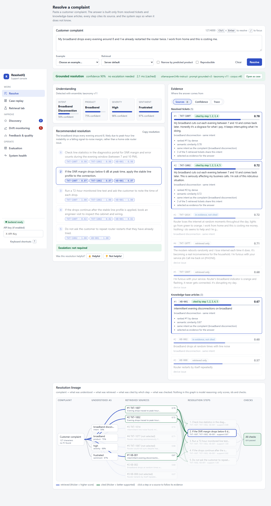
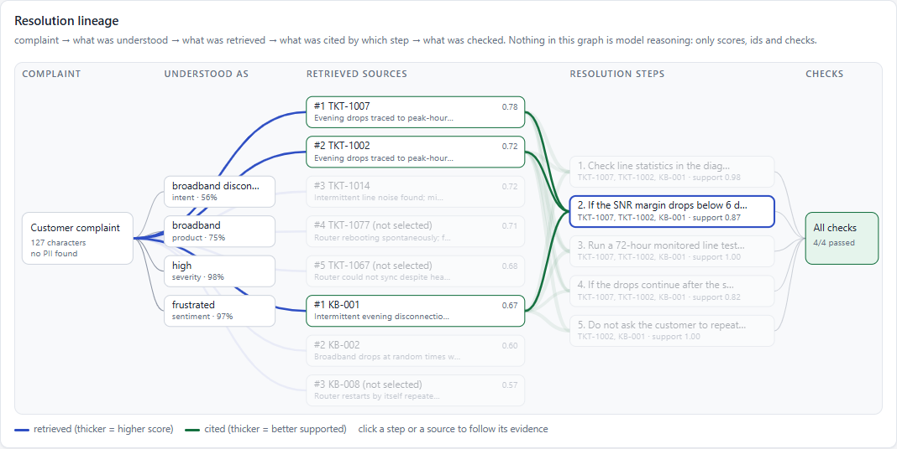
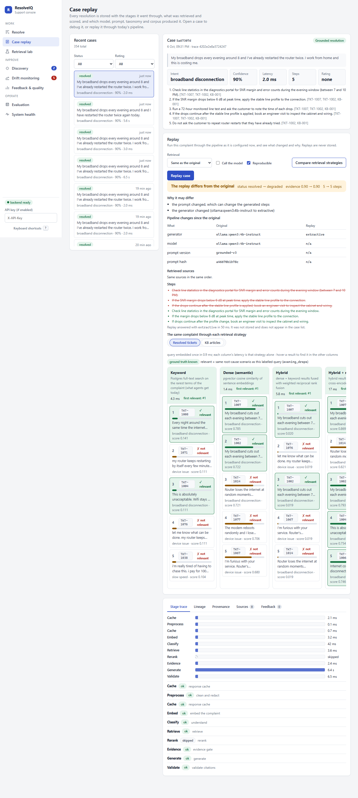
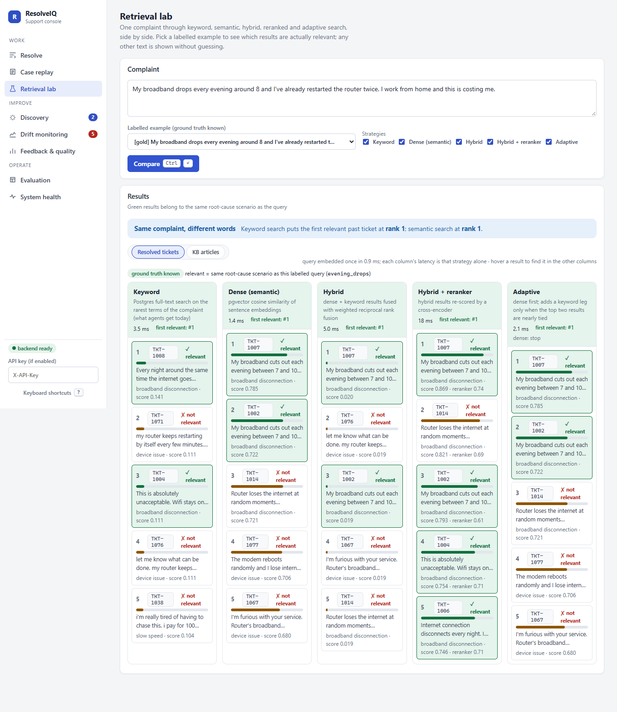
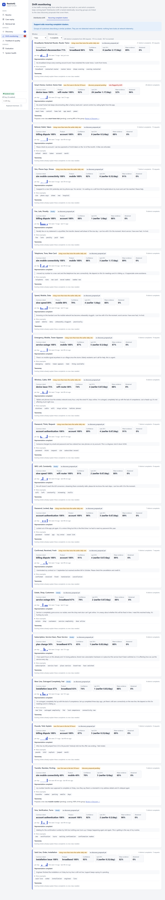
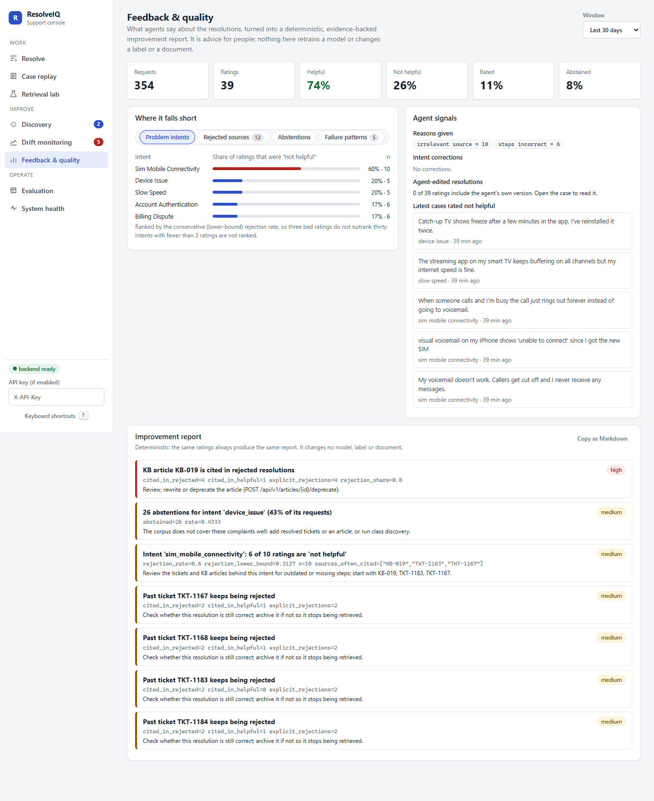
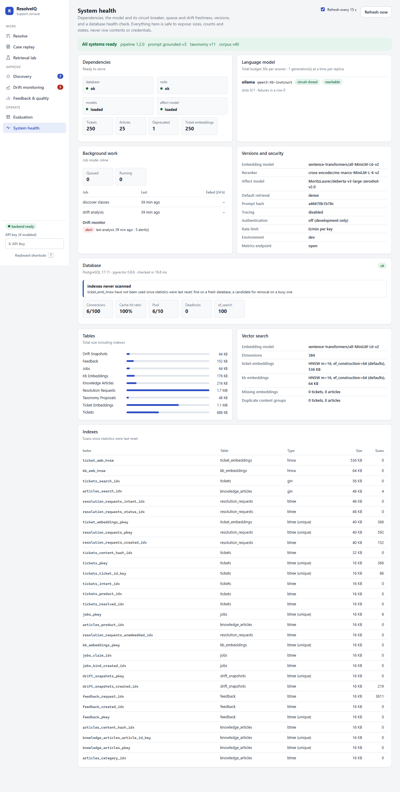

# The support console

The React console is the way an agent, a team lead or an engineer sees what the system did and why. It is a thin client over the HTTP API: nothing on
screen is computed in the browser except layout, and every number comes from a stored request, a stored result file or a live status call.

| View | Route | Keys | Question it answers | Backend |
|---|---|---|---|---|
| Resolve | `#/` | `g r` | What is wrong, what should I do, why should I trust it? | `POST /resolve` |
| Case replay | `#/cases/<id>` | `g c` | What exactly happened on that request, and would it happen again today? | `GET /cases`, `GET /cases/{id}`, `POST /cases/{id}/replay`, `POST /cases/{id}/compare` |
| Retrieval lab | `#/lab` | `g l` | Which retrieval strategy finds the right source for this complaint? | `POST /retrieval/compare`, `GET /retrieval/examples` |
| Discovery | `#/discovery` | `g d` | Which complaint groups does the taxonomy not cover? (human review) | `/taxonomy/discover`, `/taxonomy/proposals` |
| Drift monitoring | `#/drift` | `g m` | Is traffic moving away from what the system was built on, and which complaints keep coming back? | `/monitoring/drift/*`, `GET /clusters/recurring` |
| Feedback and quality | `#/quality` | `g q` | Where do agents reject answers, and what would improve them? | `GET /quality/summary`, `GET /quality/report` |
| Evaluation | `#/evaluation` | `g e` | What do the recorded evaluation, load-test and database runs say? | `GET /evaluation/results` |
| System health | `#/health` | `g h` | Are the dependencies, the model, the queue, the drift job and the database healthy? | `GET /system/status`, `GET /system/db` |

`?` opens the shortcut list, `/` focuses the complaint box, `Ctrl+Enter` resolves, `1`-`9` select a resolution step. Every view has loading, empty and error states
(a failed call shows the message and a retry button, never a blank page); the layout works from phone width up, supports light and dark mode, and tabs and
dialogs are keyboard operable. `backend/scripts/ui_smoke.py` drives all of this in a real browser and fails on any console error.



## Resolve

Order on screen follows what an agent needs first: the complaint, how it was understood (intent, product, severity, sentiment with confidences), the recommended
resolution as numbered steps with their citations and per-source support, the escalation decision, and then the evidence (sources with the reasons each was
retrieved), the confidence breakdown and the stage trace. A header line states the model, prompt version, taxonomy version and corpus version that produced
the answer. Feedback is one click, with a short reason form for "not helpful".

## Evidence graph (resolution lineage)



Every response carries a `lineage` object, built by `rag/lineage.py` from the validated result, not from the model's own account of itself:

```
complaint -> understood as (intent, product, severity, sentiment)
          -> retrieved sources (rank, score, why retrieved, selected for the prompt, in the prompt, cited by steps)
          -> resolution steps (with the support each step gets from each of its citations)
          -> checks (every citation maps to a retrieved source, no invalid citation survived, ...)
```

Clicking a step highlights the sources that support it and the paths between them; clicking a source shows why it was retrieved (rank, method, similarity, same
intent, how many of the retrieved tickets share that intent) and which steps cite it. The graph is drawn from the data with plain SVG and works without a graph library.

What it shows is limited to **safe signals**: evidence strength, agreement among sources, similarity, reranker probability, citation coverage, grounding
score, uncertainty and the abstention reason. It never shows the model's reasoning, and the model is not asked to produce any. A graph for an abstained
request has no steps and says why.

## Case replay

Every resolution is stored as a case: the redacted complaint, the stage trace, the provenance, the lineage, the retrieved sources and the feedback. A case page offers:

* **Stage trace** with the latency and status of preprocess, cache, embed, classify, retrieve, rerank, evidence gate, generate and validate, each expandable to its
  non-sensitive inputs and outputs (counts, scores, versions, decisions; never text). Skipped stages say why they were skipped.
* **Provenance**: pipeline version, model and provider, prompt version and hash, taxonomy version, corpus version, embedding model, retrieval configuration and the
  generation settings that were used.
* **Replay**: runs the stored complaint through the pipeline as it is configured now, optionally with another retrieval strategy, with or without the model,
  and in the deterministic mode (temperature 0, fixed seed) so that a difference is not sampling noise. The result is diffed against the original: status, evidence
  strength, classification changes, retrieved sources that were added, removed or moved, steps added and removed, and "pipeline changes since the original" (which version
  differs). The headline is either "Reproduced exactly" or "The replay differs from the original", followed by the likely reasons derived from the version differences.
  Replays are not stored and do not appear in the case list.
* **Compare retrieval strategies**: the same complaint through each strategy side by side.

Cases served from the response cache keep the original trace and say that they came from the cache. Cases older than the migration have no trace; the page says so
instead of inventing one.



## Retrieval lab

One complaint, five strategies (keyword, dense, hybrid, hybrid + reranker, adaptive) in columns with rank, score and latency per result. For the labelled examples
the ground truth is known, so each result is marked relevant or not and each strategy gets a first-relevant rank; free text has no ground truth and the page says so.
A banner states where keyword search and semantic search each put the first relevant ticket, which is the point of semantic retrieval. Hovering a source highlights the same source in the other columns.



## Recurring complaint clusters (inside Drift monitoring)



`GET /clusters/recurring` groups recent complaints that mean the same thing (average-linkage clustering on the stored query embeddings, cosine distance 0.55, minimum
size 3 by default) and reports, per group: size, a representative complaint (closest to the centroid), the dominant intent and product, the time pattern (first and last
seen, daily counts), a confidence (the mean of a cohesion score and the share of the group that agrees on one intent), examples, and the taxonomy proposal that covers the group when there is one. **These are support-side
recurring complaint groups, not network incidents**: ten people writing in about the same thing is a signal worth looking at, and the page does not claim to know whether
the cause is a network fault. The groups are computed on demand from rows already stored (no new embedding calls) and are linked to the discovery proposals through shared
request ids, so a group that no proposal covers is visible as a gap.

## Feedback and quality



Each rating is stored with the request, the classification, the evidence, the resolution, the citations, the reasons the agent selected, the sources they rejected, the
corrected intent and the agent's edited steps (redacted), the timestamps, and a copy of the pipeline versions, so later changes cannot rewrite what was rated.

The view and `GET /quality/summary` report helpful and rejection rates, problem intents (ranked by the lower bound of a Wilson interval, so three rejections out of three
do not outrank thirty out of forty; fewer than three ratings are shown but never ranked), most-rejected sources, weak KB articles, abstention reasons and failure
patterns (reason combinations, wrong-intent corrections, degraded and unreliable answers). `GET /quality/report` turns the same numbers into a deterministic
improvement report: the same rows always produce the same text, every finding says how many ratings it rests on, and the report is **advisory**. Nothing in this system
retrains a model, edits a document, changes a label or promotes a proposal because of feedback; a person acts on the report.

## Evaluation and system health

The Evaluation view renders the recorded result files (evaluation run, drift demo, pgvector scale experiment, query plans, ingestion benchmark, load test) with the path and
write time of each file and the caveat that came with it; a section whose file does not exist is absent rather than filled with a placeholder.
System health shows readiness of each dependency, versions, LLM circuit state and concurrency slots, queue depth by kind, drift freshness and the database report described
in [`database.md`](database.md).


