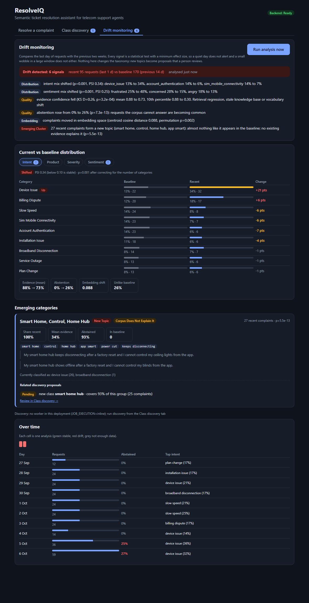

# Drift monitoring

How ResolveIQ notices that live traffic is moving away from what the system was built and tuned on, tells a person *what* moved, and
hands new topics to the existing taxonomy-discovery workflow. Lightweight by design: no model is retrained and nothing in the taxonomy changes
without a human accepting a proposal.



*The screenshot is real UI output, but the traffic is synthetic: `scripts/seed_drift_traffic.py` placed 170 labelled complaints 2 to 12 days back, 70 more in the last
day, and 25 invented smart-home-hub complaints (all abstained) in the last day, in a scratch database.*

## 1. Two layers

| | Fast layer (existing) | Statistical layer (this phase) |
|---|---|---|
| Code | `observability/drift.py` | `drift/` (`stats.py`, `detect.py`, `service.py`) |
| Runs | worker, every 5 min, SQL over logged requests | worker job `drift_analysis`, every `DRIFT_ANALYSIS_HOURS` (6) or on demand |
| Looks at | abstention rate, mean evidence, label-mix Jensen-Shannon divergence, negative feedback | all of that **with significance tests and effect sizes**, plus embeddings and new-topic clusters |
| Output | Prometheus gauges, `GET /monitoring/drift` | persisted analysis (`drift_snapshots`), `GET /monitoring/drift/status`, UI tab, gauges |
| Cost | negligible | embeds a bounded sample (at most 500 recent and 1,000 baseline distinct complaints) |

The fast layer is kept because it is cheap and already feeds alerts. Its JS-divergence threshold (0.10) has no significance test behind it, so on small windows it can
fire on noise; the statistical layer is the one to trust for a verdict.

## 2. What is monitored

Two windows of logged `/resolve` requests: **recent** (last `DRIFT_WINDOW_HOURS` = 24) and **baseline** (the `DRIFT_BASELINE_DAYS` = 14 days before that).

| Signal | What it catches | Test | Effect-size gate |
|---|---|---|---|
| Intent, product, severity, sentiment mix | a topic surge, a new product problem, angrier customers | chi-square homogeneity **and** a test per category, combined (see 3.2) | PSI >= 0.10 |
| Evidence confidence | stale knowledge base, retrieval regression, vocabulary change | two-sample Kolmogorov-Smirnov | KS D >= 0.15 and recent mean lower |
| Abstention rate | requests the corpus cannot answer | two-proportion test (Fisher exact for small counts) | rise >= 10 points |
| Embedding centroid | complaints moving in vector space (style, language, topic) | permutation test on the cosine distance between window means | distance >= 0.02 |
| New-topic clusters | a recurring group of complaints unlike the baseline | exact hypergeometric test per cluster (see 3.3) | recent share of the cluster >= 2x its share overall |
| "Unlike baseline" rate | descriptive only | share of recent complaints farther from every baseline complaint than 95% of baseline complaints are from each other | none (no alert) |

Over time: `GET /monitoring/drift/timeline` returns requests, abstention, mean evidence and the intent mix per day or hour, and every analysis is stored, so the status history
is a time series.

## 3. Method

### 3.1 Why tests *and* effect sizes
Significance alone fires on trivial differences once a window holds thousands of requests; effect size alone fires on noise when it holds thirty. An alert needs both.
Windows with fewer than 30 requests are reported (`insufficient_data`) and never alerted on. Exact duplicate complaints are collapsed before every embedding test, and
before the two quality tests (evidence, abstention): a complaint repeated 20 times has one evidence value, and counting it 20 times as independent observations inflated false alarms
from 1.0% to 5.0% in the demo (3.4). The category-mix tests keep every request, because a surge of repeats is a real change in traffic.

### 3.2 Multiple tests
A report runs 7 tests (4 category dimensions, evidence, abstention, centroid). Their p-values are corrected together with **Holm-Bonferroni** at a family-wise level of
`DRIFT_ALPHA` = 1%, so a report with no real drift raises an alert about 1% of the time (about once in 25 days at 4 analyses a day), however many things it checks.
Inside one category dimension, two views are combined with a factor-2 Bonferroni: the omnibus chi-square (the whole mix moved a little) and the smallest per-category
p-value times the number of categories (one category moved a lot). The per-category view matters: with 9 intents the omnibus test dilutes a single-intent surge.
The explanation shipped with each alert comes from the per-category table: share in each window, change in points, own p-value, share of the PSI, and a flag (`up`, `down`, `new`, `vanished`).

### 3.3 New topics
Recent and baseline complaints (distinct, embedded with the production embedding model) are clustered **together**, without the clustering seeing which window each came from, using the
same average-linkage routine as discovery (`discovery/clustering.py`) at a looser cosine distance (`DRIFT_CLUSTER_DISTANCE` = 0.65; discovery uses 0.55 on a pre-filtered set, while here the
in-domain complaints are clustered too). Each cluster with at least 4 recent members is tested: given the cluster size, how likely are this many recent members if the windows were exchangeable?
Because the clustering ignores window membership, that count is exactly hypergeometric under "no drift", so the p-value is exact, needs no novelty threshold, and is Bonferroni-corrected
over the clusters tested (own 1% budget). A significant cluster is a **new topic** when at most 15% of its members are from the baseline, and a **surge** of a known topic otherwise.
It is `covered_by_corpus` when its recent members' mean evidence is above `DISCOVERY_NOVELTY_THRESHOLD` and fewer than half were abstained.

### 3.4 What was tried, and what it cost to learn
Recorded because the first designs were wrong:
* A first version flagged complaints beyond a nearest-neighbour similarity threshold and compared the largest cluster of them with a resampling null. A first demo run found almost
  no new topics. With `all-MiniLM-L6-v2` the novel topics are about as internally similar as existing intents (0.43 to 0.58 mean pairwise cosine vs 0.33 to 0.48), and only about half of
  their complaints fall below a per-complaint novelty threshold, so no setting of that design had power at these window sizes.
* The two designs (thresholded, and the hypergeometric one above) were compared on a **leave-one-intent-out proxy** that touches neither the three demo topics nor the two tuning topics:
  an in-domain intent is removed from the baseline and injected into the recent window. Both recovered at most 6/45 injected topics of 10 complaints, so power could not separate them; the
  hypergeometric design was kept for being exact, simpler and much faster (about a second per report against tens of seconds for the resampling null). The cluster distance (0.45 / 0.55 / 0.65 / 0.75) was chosen on the same proxy: 0.65 (6/45 vs 1/45 at 0.45 and 0.55).
* The first demo split the traffic into two *random* halves; the halves differed in label mix, and the tests (correctly) reported drift between two different populations. The split is now
  stratified so label mixes match, and the control scenario is evaluated with and without repeated complaints, which is how the duplicate-counting problem above was found.
* Because those choices were made while looking at demo output, treat the demo numbers below as a description of this design on this data, not as an independent test.

## 4. Linking to taxonomy discovery

Each cluster carries its member request ids. `DriftService` looks up the discovery proposals (`taxonomy_proposals`, any state except `superseded`) that contain any of them, and attaches
`related_proposals` with the overlap, **re-read on every status request**, so accepting or rejecting a proposal shows up in the drift view immediately.

If a significant cluster is not covered by the corpus and no proposal contains at least half of its members, the analysis reports `discovery.recommended` and, in queue mode with
`DRIFT_TRIGGER_DISCOVERY=true`, enqueues one `discover_classes` job (`payload.triggered_by = "drift"`), unless one is already queued or running or the last one started less than
`DRIFT_DISCOVERY_COOLDOWN_HOURS` (12) ago. Discovery still only produces *pending proposals for a person to review*. Known cost: a discovery run supersedes the pending proposals and regenerates
them from the current candidates (existing behaviour, also for the scheduled run), so a reviewer who has a proposal open may find it replaced.
In inline mode (no worker) nothing is enqueued; the UI says so and points to the Class discovery tab. The cluster's keywords and intent are
the ones discovery would use, so a drift cluster and a discovery proposal describe the same group (the demo checks this with the production proposal builder, section 6).

## 5. Interfaces

| | |
|---|---|
| `GET /api/v1/monitoring/drift/status` | latest analysis: windows, alerts, per-dimension distributions, quality and embedding results, `tests` (p-values, correction), emerging clusters with related proposals, discovery decision. `{"status": "no_analysis"}` before the first run |
| `POST /api/v1/monitoring/drift/run` | enqueue an analysis (`202` + job id; optional `window_hours`, `baseline_days`) |
| `GET /api/v1/monitoring/drift/history?limit=` | past analyses: status, alert count, cluster count |
| `GET /api/v1/monitoring/drift/timeline?days=&bucket=day\|hour` | volume, abstention, mean evidence, intent mix per bucket |
| `GET /api/v1/monitoring/drift` | the original fast report, unchanged |

UI: the **Drift monitoring** tab (badge = number of alerts). It shows the verdict banner, each alert in plain language with its p-value and effect size, current vs baseline bars per category
(per dimension, flagged categories highlighted), quality and embedding tiles, emerging groups with keywords, examples, evidence and abstention, their related proposals with review state and a link
to the Class discovery tab, and the analysis history and daily traffic.

Metrics (worker, `:9100`): `resolveiq_drift_alert{signal}`, `resolveiq_drift_emerging_clusters`, `resolveiq_drift_unseen_rate`, `resolveiq_drift_analyses_total{status}`,
`resolveiq_drift_last_analysis_timestamp_seconds`. Alerts in `infra/prometheus/alerts.yml`: `DriftEmergingTopic`, `DriftDetected` (persists for 7 h, i.e. two analyses), `DriftAnalysisStale`.
Trace span: `drift.analyze`.

## 6. Settings

| Env var | Default | |
|---|---|---|
| `DRIFT_WINDOW_HOURS`, `DRIFT_BASELINE_DAYS` | 24, 14 | recent window; baseline = the days before it |
| `DRIFT_ALPHA` | 0.01 | family-wise false-alarm budget per report (and again for clusters) |
| `DRIFT_MIN_REQUESTS` | 30 | below this in either window: report only |
| `DRIFT_PSI_THRESHOLD`, `DRIFT_KS_THRESHOLD`, `DRIFT_ABSTENTION_INCREASE`, `DRIFT_EMBEDDING_SHIFT` | 0.10, 0.15, 0.10, 0.02 | minimum effect sizes |
| `DRIFT_CLUSTER_DISTANCE` | 0.65 | grouping distance for new-topic clusters |
| `DRIFT_MAX_EMBED_RECENT`, `DRIFT_MAX_EMBED_BASELINE`, `DRIFT_PERMUTATIONS` | 500, 1000, 500 | cost bounds |
| `DRIFT_ANALYSIS_HOURS` | 6 | worker schedule (0 = on demand only) |
| `DRIFT_TRIGGER_DISCOVERY`, `DRIFT_DISCOVERY_COOLDOWN_HOURS` | true, 12 | automatic discovery run for an uncovered cluster |

## 7. Operating it

* **Schedule:** the worker enqueues `drift_analysis` when the last one is older than `DRIFT_ANALYSIS_HOURS` (checked every 30 s, like scheduled discovery; two workers may rarely enqueue two, which only adds a snapshot).
  The job embeds at most 1,500 short texts and runs the tests in a thread; expect seconds to a minute on CPU. It never runs in the API process in queue mode.
* **When an alert fires:** read the alert text in the tab. A category shift or a `surge` cluster is usually an incident or campaign (look at the timeline). A `new_topic` cluster whose evidence is low
  needs a proposal: open the linked one (or run discovery) and accept, extend or reject it. Falling evidence with no new cluster points at the knowledge base or an embedding/model regression.
* **Not an auto-fix:** nothing is retrained and no label is created by drift monitoring.
* **Baseline:** rolling (the 14 days before the recent window), so it follows the business but also absorbs slow drift and, for a while after an accepted proposal, shows the new intent as a change.
  For release gating use the labelled evaluation suites, not this.
* **Scaling:** work is bounded by the sample caps, not by traffic. A deployment with many tenants or channels should run one analysis per slice (not built).

## 8. Evidence: the deterministic injection demo

```bash
cd backend
python -m app.evaluation.drift_demo            # ~20 s, no database or LLM; writes data/eval/results/drift_demo.json and docs/drift_demo_results.md
python -m pytest tests/test_drift_detect.py    # unit tests of the statistics plus a reduced demo
```
Traffic: the 301 hand-written labelled complaints (queries, gold, blind), split into two disjoint halves with matched label mix; baseline 300 requests from one half, recent 100 from the other (with
replacement, so repeated complaints occur as in real traffic). Each scenario changes exactly one thing in the recent window; seeds are fixed. Evidence is the top-1 cosine similarity to the 250-ticket
corpus (a stand-in for the pipeline's evidence confidence); the classifier is the ground-truth label (novel complaints get their nearest ticket's intent). **The statistics are the production code
(`drift/detect.py`); the traffic and evidence are stand-ins.** Full tables and one alert text per scenario: [`drift_demo_results.md`](drift_demo_results.md).

Final run (30 trials per scenario, 200 control trials):

| Question | Result |
|---|---|
| Nothing changed: how often does a report alert? | **2 of 200 (1.0%, 95% interval 0.3% to 3.6%)**; also 2 of 200 for windows without repeated complaints. Target: 1% |
| `billing_dispute` 16% to 40% of recent traffic | detected 30/30, boosted intent named as the top mover 30/30 |
| 16% to 33% | detected 10/30 (33%); to 25%: 0/30, by design (PSI below 0.10; still 3/30 with 4x the traffic) |
| high/critical severity 30% to 55% | detected 27/30 (90%); to 40%: 0/30 |
| 10 of 100 recent complaints are a topic the corpus never saw | cluster recovered 19/30 (63%), 0 unmatched significant clusters |
| 4 or 6 of 100 | 0/30: **not detectable at this window size** |
| Three new topics at once (8 each) | at least one recovered 15/30 (50%), 0.7 of 3 topics per report, 0 unmatched clusters |
| Whole recent window in chat-widget style | detected 25/30 (83%) through evidence, abstention, centroid and cluster signals |
| Corpus loses the tickets for 3 of 9 intents | detected 2/30 (7%) |

Linking: for the three-topic scenario the demo runs the production proposal builder (`build_proposals`) on the same window and checks that the drift cluster shares complaints with a proposal
(e.g. a drift cluster of 8 "number porting" complaints shares 5 with the `new_class` proposal `old_number`).
An integration test does the same against Postgres with the real API (`tests/test_drift_service.py`): a synthetic incident of 25 complaints is found as a significant new-topic cluster
(p about 5e-13), `discovery.run` then produces a proposal covering 25 of its 27 complaints, and rejecting that proposal flips the state shown in the drift view.

## 9. Limitations and false-positive behaviour

* **Power is limited and depends on volume.** A new topic needs roughly 8 to 10 complaints that cluster together in one window; at 100 requests per window, 4 to 6 are invisible and 10 are found about
  two times in three. MiniLM puts new telecom topics close to existing ones, so single-complaint novelty is weak (the discovery evaluation reports AUC about 0.8 for the best single signal). A larger embedding model would raise power;
  it was not tried. Real windows are larger, but real topics also arrive more slowly, and this has not been measured on real traffic (there is none).
* **Small shifts are deliberately not alerts.** A category must move by about 17 points (16% to 33%) at 100 requests for even a one-in-three detection, and a 9-point rise (16% to 25%) is below the PSI gate at any volume.
  Lower `DRIFT_PSI_THRESHOLD` for more sensitivity and accept more alerts.
* **False alarms:** about 1% per report when nothing changes, in this demo. In production the assumptions behind that figure are weaker: requests from one customer or one incident are not independent, windows overlap
  between consecutive analyses (6 h apart, 24 h long) so a breach is rarely a single alert, and real traffic has daily and weekly seasonality that a 24-hour window against a 14-day baseline will read as drift
  (for example Monday spikes). Mitigations in place: `DriftDetected` needs two consecutive analyses; the emerging-topic alert is a request to review, not a page. Not built: seasonality-aware baselines.
* **Duplicate handling is a trade-off.** Collapsing repeated complaints in the quality tests removes false alarms but also power: in the demo the stale-knowledge-base scenario (7%) and vocabulary shift (83%) lost sensitivity
  when this was added, and a single repeated complaint that fails in a new way is invisible to them (the category and cluster views still see it as volume where applicable).
* **Taxonomy changes look like drift:** after a proposal is accepted, the new intent appears in the recent window and not the baseline, and requests reclassified later move between labels.
* **Rolling baseline** absorbs gradual drift (months). Comparing against a frozen reference (the data the system was evaluated on) is not implemented.
* **Demo realism:** evidence is a proxy, the classifier is the ground truth, the traffic is 301 hand-written complaints, and a hand-written chat-style rewrite is one narrow idea of a vocabulary shift. A real
  deployment needs its own calibration run on its own history before the thresholds are trusted.
* **Multi-tenant / per-channel slices, fading topics (a topic that disappears) and embedding-model-change detection** are not implemented.
