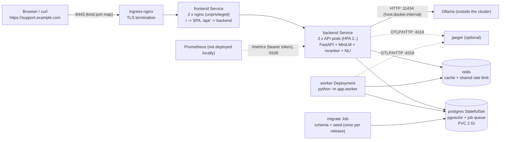

# Kubernetes deployment (tested on a local kind cluster)

ResolveIQ's manifests (`k8s/base/`) were applied to a real cluster for the first time on 2026-10-06 and exercised end to end. This
page says what that cluster was, how to reproduce it, what was and was **not** tested, what the test found, and what would change for a
cloud deployment. **Nothing here is a claim of production-grade Kubernetes infrastructure**: the cluster is one node on a laptop.

> **Which code this evidence is from.** The first cluster run (`k8s/local/results/2026-10-06/`) was recorded on commit `b57fe0c` (recorded there as `2d32e72`, before the history was rewritten).
> On 2026-10-07 the **current code was redeployed** to the same cluster and re-tested (`k8s/local/results/2026-10-07/`): the end-to-end test passed **22 of 22** checks, the LLM-down variant
> **16 of 16**, the migrate Job upgraded the existing database in place (migrations 003 and 004), and the pods ran the pinned package versions of `backend/constraints.txt`. The rolling-restart,
> taxonomy-propagation, packet-dropping-LLM and NetworkPolicy runs below were not repeated on the new code; the manifests they exercised did not change.

## 1. What was tested, and what was not

| Tested on the kind cluster (evidence in [`k8s/local/results/2026-10-06/`](../k8s/local/results/2026-10-06/)) | Not tested |
|---|---|
| Cluster creation, image build and load, ordered rollout (secrets → datastores → migrate/seed Job → workloads) with `k8s/local/deploy.sh` | A multi-node cluster, node failure, zone spread, real cluster upgrades |
| API (2 replicas), worker, frontend (2 replicas), Postgres 17 + pgvector, Redis, Jaeger all Ready; startup/readiness/liveness probes | A managed Postgres / Redis, TLS to them, failover |
| Real complaint through **Ingress → nginx frontend → Service → API → Postgres/Redis/embedder/reranker/NLI → Ollama → validated answer** | A GPU node or an in-cluster LLM (the model runs on the host, outside the cluster) |
| Synchronous ingestion; asynchronous batch ingestion executed by the **worker Deployment** | Several workers contending for jobs on Kubernetes (covered by the unit tests of the queue, not re-run here) |
| `/health`, `/health/ready`, `/metrics` (token required, not exposed by the frontend), worker `:9100/metrics` | Prometheus/Grafana in the cluster (metrics endpoints were scraped by hand, no Prometheus Operator) |
| OpenTelemetry: API and worker export OTLP to Jaeger; one resolve = one trace tree, no duplicate spans | A real collector, sampling under load, a hosted tracing backend |
| LLM unavailable: evidence-only (`degraded` / `extractive`) answers with valid citations; readiness stays 200; recovery after the LLM returns | Load testing on Kubernetes (deliberately not repeated; see `docs/performance.md` for the single-host numbers) |
| NetworkPolicy default-deny with allow rules (verified by connection attempts) | Any policy engine other than kind's (kindnet), see §6 |
| Rolling restart under traffic (0 failed of 130 and 48 requests, see §5), HPA reading live CPU through metrics-server | Autoscaling *actually scaling* under load, PodDisruptionBudget under a real node drain |
| Ingress with HTTP→HTTPS redirect and TLS termination with the controller's **default self-signed certificate** | cert-manager / Let's Encrypt, a real domain, secret rotation |
| Persistence: Postgres on a PersistentVolumeClaim (kind's local-path provisioner) | Backup/restore on Kubernetes, volume snapshots, a pod restart's effect on the PVC data |

## 2. Architecture



* **Same images, three roles**: the backend image runs the API (`uvicorn`), the worker (`python -m app.worker`) and the one-off
  migrate/seed Job. The frontend image is nginx serving the built SPA and proxying `/api/` to the `backend` Service.
* **`k8s/base/`** is the cloud-oriented set: Postgres and Redis are *external* (managed services), the image names are placeholders
  (`registry.example.com/...`), the Ingress has a real-looking host and cert-manager annotation.
* **`k8s/local/`** is a kustomize overlay that adds what a laptop needs: in-cluster Postgres/pgvector (StatefulSet + PVC), Redis, Jaeger,
  NetworkPolicies for them, local image names, 2 replicas, smaller resource requests, `OLLAMA_BASE_URL` pointing at the host, OTEL on.
  The base is used unmodified.
* **Configuration**: non-secret settings in the `resolveiq-config` ConfigMap (including every `LLM_*`, `CACHE_*` and `OTEL_*` setting);
  `DATABASE_URL`, `DATABASE_ADMIN_URL`, `REDIS_URL`, `API_KEYS`, `METRICS_TOKEN` in the `resolveiq-secrets` Secret. The pods consume both
  with `envFrom`. `APP_ENV=production`, so the API refuses to start with weak keys, a placeholder password, wildcard CORS, or an LLM budget
  that is not below the request timeout.
* **Pod security**: namespace labelled `pod-security.kubernetes.io/enforce: restricted`; every pod is non-root, drops all capabilities,
  uses the `RuntimeDefault` seccomp profile, and (except Postgres, which needs a writable data directory) has a read-only root filesystem.

## 3. Deployment steps (local kind cluster)

Prerequisites: Docker Desktop with **≥ 12 GB** assigned to the VM (each API or worker pod holds ~2.4 GB of models), `kind` ≥ 0.30,
`kubectl`, Python 3, and Ollama with `qwen3:4b-instruct` listening on the host's port 11434 (the LLM is optional: without it the system
answers from evidence only).

```bash
bash k8s/local/deploy.sh --ingress       # everything below, in order; re-runnable
python k8s/local/e2e_test.py --ingress   # 22 checks, exit code 0 = all passed
```

What the script does, as plain commands (so each step can be run, inspected and debugged on its own):

```bash
kind create cluster --config k8s/local/kind-config.yaml                      # one node; host :8080/:8443 -> the ingress controller

docker build -t resolveiq-backend:kind-base ./backend                        # models baked in (needs the network once)
docker build -f k8s/local/Dockerfile --build-arg BASE=resolveiq-backend:kind-base -t resolveiq-backend:kind data   # + seed data as /app/data
docker build -t resolveiq-frontend:kind ./frontend
kind load docker-image resolveiq-backend:kind resolveiq-frontend:kind --name resolveiq

kubectl apply -f k8s/base/namespace.yaml
python k8s/local/make_secrets.py                                             # random values, created only inside the cluster
kubectl apply -f k8s/local/postgres.yaml -f k8s/local/redis.yaml -f k8s/base/networkpolicy.yaml -f k8s/local/networkpolicy-local.yaml
kubectl -n resolveiq rollout status statefulset/postgres

kubectl kustomize k8s/local | <keep only the resolveiq-config ConfigMap> | kubectl apply -f -   # the Job reads it
sed 's#registry.example.com/resolveiq-backend:1.0.0#resolveiq-backend:kind#' k8s/base/migrate-job.yaml | kubectl apply -f -
kubectl -n resolveiq wait --for=condition=complete job/resolveiq-migrate --timeout=15m   # migrations + 250 tickets / 26 articles

kubectl apply -k k8s/local                                                   # API, worker, frontend, Jaeger, HPA, PDB, policies, Ingress
kubectl apply -f https://kind.sigs.k8s.io/examples/ingress/deploy-ingress-nginx.yaml     # optional: ingress controller
```

Useful commands afterwards:

```bash
kubectl -n resolveiq get pods,svc,hpa,pdb,ingress,networkpolicy,pvc
kubectl -n resolveiq logs deploy/backend --tail=50                           # JSON logs; trace_id on every line
kubectl -n resolveiq logs job/resolveiq-migrate
kubectl -n resolveiq port-forward svc/jaeger 16686:16686                     # trace UI on http://localhost:16686
kubectl -n resolveiq get secret resolveiq-secrets -o jsonpath='{.data.API_KEYS}' | base64 -d   # an API key for the UI's X-API-Key box
curl -sk -H 'Host: support.example.com' https://127.0.0.1:8443/health/ready
kubectl -n resolveiq rollout restart deploy/backend && kubectl -n resolveiq rollout status deploy/backend
kubectl -n resolveiq scale deploy/worker --replicas=2                        # workers are SKIP LOCKED-safe; the HPA owns the API replica count
kind delete cluster --name resolveiq                                         # throw it all away
```

Use the UI from a browser at `https://127.0.0.1:8443` (Host header `support.example.com`: add `127.0.0.1 support.example.com` to your hosts
file and open `https://support.example.com:8443`, accepting the self-signed certificate), and paste an API key into the key box.

## 4. What the end-to-end test showed

`python k8s/local/e2e_test.py --ingress`: **22 checks, 22 passed**, on 2026-10-06 (`results/2026-10-06/e2e_full_via_ingress.txt`) and again on the current code on 2026-10-07
(`results/2026-10-07/e2e_full_via_ingress.txt`: resolve in 8.4 s, of which classification 2.5 s on the pod's CPU and generation 5.9 s; 37 spans in one trace). Highlights:

* Resolve through Ingress → frontend → backend: HTTP 200, `status=resolved`, `generator=ollama:qwen3:4b-instruct`, 5 steps, 2 citations that
  point at retrieved evidence, validation valid, in 8.5–11.4 s over several runs (classification 2.3–3.3 s on the pod's CPU, generation 6–9 s on
  the host GPU). The `X-Trace-Id` response header equals the body's `trace_id` (nginx's request id is propagated end to end).
* Out-of-domain question abstains. Without a key the API answers 401; the frontend answers 404 for `/metrics`; the backend's `/metrics`
  answers 401 without the token and 200 with it; the worker exposes `:9100/metrics`.
* `POST /ingest/ticket` → 201 and the ticket is searchable immediately. `POST /ingest/tickets/batch` → 202; the **worker pod** executed the
  job (`status: succeeded`, 3 created).
* Jaeger holds traces from `resolveiq-api` and `resolveiq-worker`; one resolve is one tree of 34–38 spans with exactly one server span.
* The seed Job loaded 250 tickets and 26 articles in 3.2 s.

### The failure scenario: LLM unavailable

`OLLAMA_BASE_URL` was pointed at a closed port and the pods restarted. `e2e_test.py --degraded --ingress` passed
(`results/2026-10-06/e2e_llm_down_via_ingress.txt`):

* `/health/ready` stays **200** (`llm: {ollama: false}`): a dead model server must not take API pods out of service. A later audit found the case these runs did
  not cover: with the fallback chain configured (two providers) and the model network *dropping* packets, providers were health-checked one after the other
  for 3 s each, so readiness took 6.0 s, past this probe's 5 s timeout, which would have taken every API pod out of service. They are now checked concurrently
  (2 s cap) alongside the other checks: measured on the backend image with both providers pointed at an unroutable address, 6.0 s before and 2.0 s after
  (`tests/test_api.py::test_readiness_stays_fast_and_ready_when_every_llm_drops_packets`). This was verified on the container, not re-run on kind.
* `POST /api/v1/resolve` → HTTP 200, **`status=degraded`, `generator=extractive`**, 7 steps, 2 valid citations, with the warning
  "LLM unavailable ... returned evidence-only resolution", in ~3.6 s (it is the classifier, not the LLM, that takes the time).
* Eight consecutive requests all returned evidence-only answers with HTTP 200 (`llm_down_latency_final.txt`).
* After restoring the URL the next full run was back to LLM-generated answers.

A second, nastier variant was observed on the way: when packets to the model server are *dropped* instead of refused (the closed port behaved
that way for a while, cause not established), each attempt waited out the whole 30 s LLM budget: requests took 33 s, and again after every
30 s breaker cool-down. The provider now bounds the TCP connect separately (`LLM_CONNECT_TIMEOUT_SECONDS`, default 5): the same scenario
went from **33 s to 13.5 s** for the requests that probe the LLM, with all other requests at pipeline speed
(`llm_unreachable_dropped_packets_before/after_connect_timeout.txt`, 6 and 8 requests: a small sample).

## 5. Findings from running it on Kubernetes (and what was changed)

Every item below was found by the deployment itself; none was visible in the manifests or the Docker Compose runs.

| # | Finding (measured) | Fix |
|---|---|---|
| 1 | The base manifests set `DATA_DIR=/app/data` but nothing provided it (Compose mounts `./data`). The seed Job would have had no corpus. | `k8s/local/Dockerfile` bakes the data into the image; the requirement is documented in the base ConfigMap and kustomization. For production, build it into the image in CI. |
| 2 | The seed Job hung for 7+ minutes: the models call the Hugging Face Hub at start-up and the default-deny egress policy silently dropped it (`SYN_SENT` to port 443). | `HF_HUB_OFFLINE=1`, `TRANSFORMERS_OFFLINE=1` in the ConfigMap (weights are baked into the image). Seeding then took 3.2 s. |
| 3 | The migrate Job was `OOMKilled` three times at its 2 Gi limit (it loads the NLI model to classify tickets). | Base Job: request 2 Gi, limit 5 Gi (the same as the API). |
| 4 | **FastAPI 0.142 enables its own OpenTelemetry (traces, metrics *and* logs with exception messages) whenever `OTEL_EXPORTER_OTLP_ENDPOINT` is a process environment variable**, which is exactly how Kubernetes sets it. We saw a stream of failed OTLP *metrics* exports (HTTP 404 from Jaeger) and it would have duplicated every server span and exported exception text. | `FastAPI(telemetry={...all off...})` (only when the installed version has the parameter), plus a test. After the fix: no export errors, one server span per request (checked in Jaeger). |
| 5 | **A taxonomy change made through one API replica never reached the others or the worker** until they restarted (each process caches the taxonomy and its prototype embeddings). Measured: replica A at version 2, replica B still at version 1 after 40 s. This affects the headline "evolving classes" feature in any multi-replica deployment, including Compose. | Each process checks the taxonomy version in Postgres every `TAXONOMY_SYNC_SECONDS` (default 10) and reloads on a change. Measured after the fix: the other replica converged in 8.2 s and the worker logged the reload. Tests added. |
| 6 | The migrate Job pods matched no NetworkPolicy, so under default-deny they could not reach Postgres, Redis or DNS. | Label `app: migrate` and an `allow-migrate` policy. OTLP (4318) added to the backend/worker egress. |
| 7 | A rolling restart under steady traffic returned **2 × HTTP 502 in 127 requests**, right when old pods terminated (a pod is told to stop slightly before the Service stops routing to it). | `preStop: sleep 10` on the backend and frontend. After: 0 failures in 130 requests (through a port-forward) and in 48 (through the Ingress). Small samples, but the failure mode and the standard fix are well understood. |
| 8 | `/health/ready` and the manifests were fine, but the documented release order was wrong: the migrate Job needs the ConfigMap, and API pods started before the seed had an empty taxonomy. | Corrected in `k8s/base/kustomization.yaml`; `deploy.sh` encodes the order. Finding 5's sync also makes late-seeded pods self-correct. |
| 9 | The worker Deployment had no readiness probe. | Added (`/metrics` on 9100). |
| 10 | Memory: each API or worker pod holds ~2.3–2.4 GB (RSS). Restarting the API and worker together, plus an HPA surge, put 5–6 such pods on a 15 GB VM; the node thrashed, the API server timed out and kind's network-policy agent lost its API watch. | Local overlay caps the HPA at 2 replicas; `deploy.sh` rolls the Deployments one after another. See §6 for the policy agent. |
| 11 | (2026-10-07) The image built from unpinned requirements 14 hours after the evaluation already ran different library versions (`fastapi` 0.142.2, `torch` 2.14.1, `transformers` 5.18.0 versus 0.141.1, 2.8.0, 5.17.0), so the deployed system was not the evaluated one. | `backend/constraints.txt` (generated from the evaluation environment by `scripts/freeze_constraints.py`) is applied by the Dockerfile and CI; the redeployed pods report the evaluated versions. |
| 12 | (2026-10-07) The migrate Job's first pod timed out connecting to Postgres (kindnet policy-sync lag, see section 6); the Job retried and succeeded. | None needed: the Job's `backoffLimit` absorbs it. A production CNI should not show the lag. |

## 6. Limitations and caveats (read before trusting any of this)

* **One node, one laptop.** kind runs the control plane and every workload in a single Docker container on a Windows/WSL2 host. There is
  no node failure, no zone spread, and the PodDisruptionBudget and topology-spread constraints were never exercised.
* **kind's network-policy agent (kindnet) is not production-grade.** Policies were verified by connection attempts (the frontend reaches only
  the backend; the backend reaches Postgres, Redis, Jaeger and the host's Ollama; the backend cannot reach the frontend). But (a) it programs
  rules in periodic syncs, so a pod that starts between syncs can be cut off from Postgres for up to ~1 minute and crash-loops until the next
  sync (one rolling restart took 181 s with four start-up crashes on "error connecting" to Postgres, which I attribute to this lag; that run was discarded as a measurement); and (b) after the memory-starvation
  incident it **failed open** (the frontend suddenly reached Postgres) until the kindnet DaemonSet was restarted
  (`results/.../networkpolicy_enforcement.txt`). Use Calico or Cilium and test enforcement in your own cluster.
* **The LLM is outside the cluster.** Ollama runs on the host and is reached through `host.docker.internal`. Its throughput (≈ 0.19 answers
  per second on one RTX 4070, see `docs/performance.md`) is what limits the system, and nothing about Kubernetes changes that.
  `LLM_MAX_CONCURRENCY` is **per API replica**: with N replicas sharing one model server, N generations can be in flight at once, so the
  queueing described in the performance report becomes the model server's queue. Size or rate-limit accordingly.
* **API replicas share one model server and one Redis rate limiter.** The limiter is shared (a probe at ~4 req/s drew HTTP 429s once the
  per-key 120/minute budget was spent across both replicas), which is the intended behaviour.
* **The Ingress used the controller's fake certificate.** HTTP→HTTPS redirect and TLS termination work; certificate issuance, renewal and
  HSTS were not tested. The kind ingress-nginx manifest is fetched from the internet and is not committed.
* **Throwaway data.** Secrets are random and live only in the cluster. The test added a few tickets and taxonomy classes to the cluster's
  database; the dev and evaluation databases were never touched.
* **No load test** was run on Kubernetes (by design); the only latency numbers here come from single requests and the availability probe.
* **Small samples.** The rolling-restart comparison is 2/127 failures versus 0/130 and 0/48; the connect-timeout comparison is 6 versus 8
  requests. They show the mechanism, not a rate.

## 7. Scaling approach

| Component | How it scales | Notes |
|---|---|---|
| API | Horizontal, stateless; HPA on CPU (65 %) between 3 and 12 replicas in the base (2 locally) | CPU is a poor proxy when the LLM is the bottleneck: requests *waiting* for the model use almost no CPU. Prefer a custom metric (in-flight requests, `resolveiq_llm_in_flight`, p95 latency) via KEDA or prometheus-adapter. Scale-down stabilisation is 5 min; new pods need ~20-40 s to load models, so keep headroom. |
| Worker | Horizontal; jobs are claimed with `FOR UPDATE SKIP LOCKED` | Scale on `resolveiq_job_queue_depth` (KEDA). 120 s termination grace lets a job finish. |
| Frontend | Horizontal, trivial | |
| Postgres | Vertical first, then a read replica for search; PgBouncer when replicas × pool size nears `max_connections` | Managed service in production. |
| Redis | Managed, single primary is enough | Used for cache and rate limits only, not as a system of record. |
| LLM | Its own node pool (GPU) behind a Service; vLLM for batching | The most important scaling decision. Several API replicas multiply the pressure on it. |

## 8. What would change for a cloud deployment

* **Datastores**: managed Postgres with pgvector (RDS / Cloud SQL / Azure Flexible Server), the `resolveiq_app` role created as in
  `infra/postgres/init-roles.sh`, TLS (`sslmode=require`), automated backups with point-in-time recovery, and a tested restore. Managed Redis
  with a password and TLS. Remove `postgres.yaml`/`redis.yaml`; the base already assumes external services.
* **Persistence**: the local PVC uses kind's `local-path` provisioner (node-local, lost with the node). In the cloud use a replicated
  storage class if you self-host Postgres at all, plus VolumeSnapshots; Redis needs none. The seed data belongs in the image.
* **Images**: build and push in CI to a private registry, scan them, sign them, deploy by digest rather than the `1.0.0` tag. The backend
  image is ≈ 6 GB because the models are baked in (offline start-up, no Hub dependency); mirror it in a registry near the cluster and
  consider a slimmer base or model volume.
* **Secrets**: replace `make_secrets.py` with External Secrets Operator / Secrets Store CSI (AWS Secrets Manager, Vault, ...) or Sealed
  Secrets; enable etcd encryption; rotate API keys and the metrics token; never commit `secret.example.yaml` with real values.
* **Ingress and TLS**: an ingress controller you operate (the community ingress-nginx project's maintenance status should be checked
  before adopting it; Gateway API is the alternative), cert-manager with a ClusterIssuer (`letsencrypt-prod` as in the manifest), a real
  host, `CORS_ORIGINS` set to it, HSTS, WAF/rate limiting at the edge, and SSO/VPN in front of the UI (API keys are not user identity).
* **Autoscaling**: HPA with a metric that reflects the real bottleneck (see §7), cluster-autoscaler / Karpenter for nodes, a GPU node pool
  for the LLM, and enough headroom for the ~30 s model load of a new pod.
* **Network policy**: a CNI that enforces it (Calico, Cilium) plus egress tightened from "any destination on 5432/6379/11434/443" to the
  actual CIDRs or selectors of the managed services; test enforcement after every CNI upgrade.
* **Observability**: Prometheus Operator `ServiceMonitor`s with the metrics bearer token from a Secret (the pod annotations in the base
  cannot carry the token, so `/metrics` scraping by annotation fails against a token-protected API), Grafana dashboards
  (`infra/grafana/dashboards/resolveiq.json`), alerts from `infra/prometheus/alerts.yml`, an OpenTelemetry Collector (or a hosted backend with
  `OTEL_EXPORTER_OTLP_HEADERS` in the Secret) instead of Jaeger's in-memory store, head sampling below 1.0 (`OTEL_SAMPLE_RATIO`), log shipping.
* **Availability**: ≥ 3 nodes across zones, `topologySpreadConstraints` on zone, PDBs that match the replica counts, `maxUnavailable: 0`
  rollouts (already set), and a realistic preStop for your load balancer's deregistration delay.

## 9. Files

`k8s/base/` (the cloud manifests, now with OTEL/LLM settings, probes, preStop, migrate policy) · `k8s/local/` (`kind-config.yaml`,
`kustomization.yaml`, `postgres.yaml`, `redis.yaml`, `jaeger.yaml`, `networkpolicy-local.yaml`, `Dockerfile`, `make_secrets.py`,
`deploy.sh`, `e2e_test.py`, `taxonomy_propagation_check.py`, `degraded_latency.py`, `rollout_availability.py`) ·
`k8s/local/results/2026-10-06/` (raw outputs of every run quoted above, including the ones discarded as invalid) · `k8s/local/results/2026-10-07/` (the re-run on the current code).
